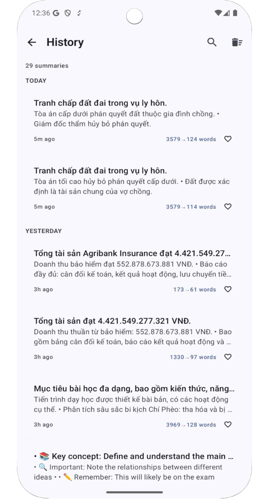

# SumUp - AI-Powered Text Summarization App

<div align="center">
  
  
  **Save 80% reading time with intelligent AI summarization**
  
  [](https://developer.android.com)
  [](https://android-arsenal.com/api?level=24)
  [](https://kotlinlang.org)
  [](https://developer.android.com/jetpack/compose)
  [](LICENSE)
  [](http://makeapullrequest.com)
</div>

## 🌟 Features

### Core Functionality
- **🤖 AI-Powered Summarization**: Powered by Google Gemini 1.5 Flash for high-quality summaries
- **📄 Multi-Format Support**: Process text, PDFs, and images (OCR)
- **🎭 6 AI Personas**: General, Student, Professional, Academic, Creative, Quick Brief
- **📊 Smart Metrics**: Track word reduction, reading time saved, and AI quality scores
- **🌍 Bilingual**: Full support for English and Vietnamese

### User Experience
- **🎨 Material You Design**: Dynamic color theming with Material 3
- **🌙 Dark/Light Modes**: Automatic theme switching
- **💾 Offline Access**: View history without internet
- **🔍 Smart Search**: Full-text search in history
- **⭐ Favorites**: Mark important summaries
- **📤 Export Options**: Text, Markdown, PDF formats

### Technical Features
- **🔒 Secure**: Encrypted API key storage
- **⚡ Fast**: 3-5 second processing time
- **📱 Responsive**: Adaptive UI for phones and tablets
- **♿ Accessible**: Full accessibility support
- **🎯 Smart Sectioning**: Handles documents up to 30,000 characters

## 📱 Screenshots

<div align="center">
<table>
  <tr>
    <td></td>
    <td></td>
    <td></td>
    <td></td>
  </tr>
  <tr>
    <td align="center">Text Input</td>
    <td align="center">AI Summary</td>
    <td align="center">History</td>
    <td align="center">Settings</td>
  </tr>
</table>
</div>

## 📥 Download

### Try SumUp Now
Download the latest APK from our [Google Drive folder](https://drive.google.com/drive/folders/14ZlVof3C42ugtQ4hR_T7P_rpb-MKZaLD)

## 🚀 Getting Started

### Prerequisites
- Android Studio Koala (2024.1.1) or later
- JDK 17
- Android SDK 35
- Minimum device: Android 7.0 (API 24)

### Quick Setup

1. **Clone the repository**
   ```bash
   git clone https://github.com/Ductam7415vn/SumUp.git
   cd SumUp
   ```

2. **Configure API Key**
   ```bash
   # Create local.properties
   echo "GEMINI_API_KEY=your_api_key_here" >> local.properties
   ```
   Get your free API key at [Google AI Studio](https://makersuite.google.com/app/apikey)

3. **Build and Run**
   ```bash
   ./gradlew assembleDebug
   ./gradlew installDebug
   ```

## 🏗️ Architecture

SumUp follows **Clean Architecture** with **MVVM** pattern:

```
app/src/main/java/com/example/sumup/
├── data/               # Data layer
│   ├── local/         # Room database, DAOs
│   ├── remote/        # API services, DTOs
│   └── repository/    # Repository implementations
├── domain/            # Business logic
│   ├── model/        # Domain models
│   ├── repository/   # Repository interfaces
│   └── usecase/      # Use cases
├── presentation/      # UI layer
│   ├── components/   # Reusable UI components
│   ├── screens/      # App screens
│   └── theme/        # Material 3 theming
└── di/               # Dependency injection
```

### Tech Stack
- **Language**: [Kotlin](https://kotlinlang.org/) 2.0
- **UI**: [Jetpack Compose](https://developer.android.com/jetpack/compose) + Material 3
- **Architecture**: Clean Architecture + MVVM
- **DI**: [Hilt](https://dagger.dev/hilt/)
- **Database**: [Room](https://developer.android.com/jetpack/androidx/releases/room)
- **Networking**: [Retrofit](https://square.github.io/retrofit/) + [OkHttp](https://square.github.io/okhttp/)
- **Async**: Coroutines + Flow
- **AI**: Google Gemini API
- **PDF**: Apache PDFBox
- **OCR**: ML Kit Text Recognition

## 📊 Performance Metrics

| Metric | Value |
|--------|-------|
| App Size | ~15MB |
| Startup Time | <2s |
| Summary Generation | 3-5s |
| Memory Usage | <150MB |
| Crash-free Rate | >99.5% |

## 🧪 Testing

```bash
# Run all tests
./gradlew test

# Run with coverage
./gradlew testDebugUnitTestCoverage

# Run specific test
./gradlew test --tests "com.example.sumup.domain.usecase.SummarizeTextUseCaseTest"
```

Current test coverage: ~45%

## 🤝 Contributing

We love contributions! Please see our [Contributing Guidelines](CONTRIBUTING.md) for details.

### How to Contribute
1. Fork the repository
2. Create a feature branch (`git checkout -b feature/amazing-feature`)
3. Commit changes (`git commit -m 'Add amazing feature'`)
4. Push to branch (`git push origin feature/amazing-feature`)
5. Open a Pull Request

### Development Setup
See our [Development Guide](docs/development/implementation-progress.md) for detailed setup instructions.

## 📖 Documentation

- 📚 [Complete Documentation](docs/README.md)
- 🏗️ [Architecture Guide](docs/architecture/02-technical-architecture.md)
- 🧪 [Testing Guide](TEST_CASES.md)
- 🚀 [API Reference](docs/api/API_REFERENCE.md)
- 📱 [UI/UX Guidelines](docs/screens/)

## 🛣️ Roadmap

- [x] Core text summarization
- [x] PDF support
- [x] OCR functionality
- [x] Multiple AI personas
- [x] Offline history
- [ ] Cloud sync
- [ ] iOS version
- [ ] Chrome extension
- [ ] More languages

See our [Development Roadmap](docs/development/05-development-roadmap.md) for details.

## 📄 License

This project is licensed under the MIT License - see the [LICENSE](LICENSE) file for details.

## 🙏 Acknowledgments

- [Google Gemini](https://deepmind.google/technologies/gemini/) for AI capabilities
- [Material Design](https://m3.material.io/) for design guidelines
- The amazing Android community
- All our [contributors](https://github.com/Ductam7415vn/SumUp/graphs/contributors)

## 📞 Support

- 📧 Email: ductam7415@gmail.com
- 🐛 Issues: [GitHub Issues](https://github.com/Ductam7415vn/SumUp/issues)
- 💬 Discussions: [GitHub Discussions](https://github.com/Ductam7415vn/SumUp/discussions)

---

<div align="center">
  <p>
    <b>Made with ❤️ by Duc Tam</b>
  </p>
  <p>
    <a href="https://github.com/yourusername/sumup/stargazers">⭐ Star us on GitHub!</a>
  </p>
</div>