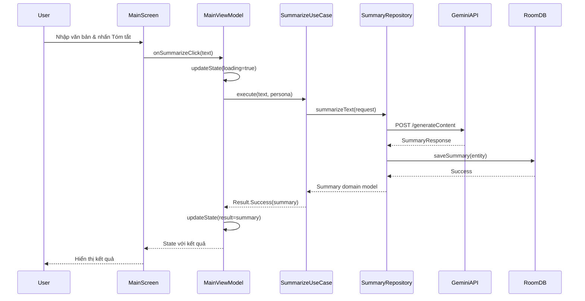

# CHƯƠNG 4: KIẾN TRÚC HỆ THỐNG

## 4.1. Tổng quan kiến trúc

### 4.1.1. Kiến trúc tổng thể
SumUp được xây dựng theo **Clean Architecture** - một pattern được Robert C. Martin (Uncle Bob) giới thiệu, đảm bảo:
- **Separation of Concerns**: Tách biệt rõ ràng giữa các layers
- **Dependency Rule**: Dependencies chỉ hướng vào trong (inward)
- **Testability**: Dễ dàng unit test từng component
- **Maintainability**: Code dễ bảo trì và mở rộng

### 4.1.2. Nguyên tắc thiết kế
1. **SOLID Principles**: Single Responsibility, Open/Closed, Liskov Substitution, Interface Segregation, Dependency Inversion
2. **DRY (Don't Repeat Yourself)**: Tránh duplicate code
3. **KISS (Keep It Simple, Stupid)**: Giữ cho solution đơn giản nhất có thể
4. **YAGNI (You Aren't Gonna Need It)**: Không implement features chưa cần thiết

## 4.2. Kiến trúc Clean Architecture

### 4.2.1. Các tầng chính

```
┌─────────────────────────────────────────────────────────────┐
│                    Presentation Layer                        │
│  ┌─────────────┐  ┌──────────────┐  ┌─────────────────┐   │
│  │   Screens   │  │  ViewModels  │  │   Components    │   │
│  │  (Compose)  │  │   (State)    │  │   (Reusable)   │   │
│  └─────────────┘  └──────────────┘  └─────────────────┘   │
└─────────────────────────────────────────────────────────────┘
                              │
                              ▼
┌─────────────────────────────────────────────────────────────┐
│                      Domain Layer                            │
│  ┌─────────────┐  ┌──────────────┐  ┌─────────────────┐   │
│  │  Use Cases  │  │    Models    │  │  Repositories   │   │
│  │             │  │   (Domain)   │  │  (Interfaces)   │   │
│  └─────────────┘  └──────────────┘  └─────────────────┘   │
└─────────────────────────────────────────────────────────────┘
                              │
                              ▼
┌─────────────────────────────────────────────────────────────┐
│                       Data Layer                             │
│  ┌─────────────┐  ┌──────────────┐  ┌─────────────────┐   │
│  │ Repository  │  │  Data Source │  │    Entities     │   │
│  │   (Impl)    │  │ (Local/Remote)│  │   DTOs/DAOs    │   │
│  └─────────────┘  └──────────────┘  └─────────────────┘   │
└─────────────────────────────────────────────────────────────┘
```

### 4.2.2. Chi tiết từng layer

**1. Presentation Layer**
- **Screens**: Compose UI screens (MainScreen, ResultScreen, etc.)
- **ViewModels**: State management, business logic orchestration
- **Components**: Reusable UI components (buttons, cards, dialogs)
- **Navigation**: Navigation graph và routing logic
- **Theme**: Material 3 theming, colors, typography

**2. Domain Layer**
- **Use Cases**: Business rules (SummarizeTextUseCase, ProcessPdfUseCase)
- **Models**: Core business entities (Summary, FileUploadState)
- **Repository Interfaces**: Contracts for data operations
- **Utils**: Business logic helpers

**3. Data Layer**
- **Repository Implementations**: Concrete implementations
- **Remote Data Source**: API calls (Gemini, mock services)
- **Local Data Source**: Room database operations
- **Mappers**: Convert between DTOs ↔ Domain models
- **Cache**: Temporary data storage

## 4.3. Component Diagram

```
┌──────────────────────────────────────────────────────────────┐
│                        Android App                            │
├──────────────────────────────────────────────────────────────┤
│                                                               │
│  ┌────────────────┐         ┌─────────────────────────┐     │
│  │  MainActivity  │────────▶│  SumUpNavigation       │     │
│  └────────────────┘         └──────────┬──────────────┘     │
│                                        │                      │
│                              ┌─────────▼──────────┐          │
│                              │  Screen Composables│          │
│  ┌──────────────────────────┴───────────────────┴─────────┐ │
│  │ MainScreen │ ResultScreen │ HistoryScreen │ Settings   │ │
│  └─────┬──────┴──────┬───────┴───────┬───────┴──────┬─────┘ │
│        │             │               │              │        │
│  ┌─────▼─────────────▼───────────────▼──────────────▼─────┐ │
│  │                    ViewModels                           │ │
│  │  MainViewModel │ ResultViewModel │ HistoryViewModel    │ │
│  └─────┬─────────────┬───────────────┬────────────────────┘ │
│        │             │               │                       │
│  ┌─────▼─────────────▼───────────────▼────────────────────┐ │
│  │                    Use Cases                            │ │
│  │ SummarizeTextUseCase │ ProcessPdfUseCase │ OCR UseCase │ │
│  └─────┬─────────────────┬───────────────┬────────────────┘ │
│        │                 │               │                   │
│  ┌─────▼─────────────────▼───────────────▼────────────────┐ │
│  │               Repository Layer                          │ │
│  │  SummaryRepository │ PdfRepository │ PrefsRepository   │ │
│  └─────┬─────────────────┬───────────────┬────────────────┘ │
│        │                 │               │                   │
│  ┌─────▼──────┐    ┌────▼────┐    ┌────▼────┐            │
│  │Room Database│    │Gemini API│    │ML Kit  │            │
│  └─────────────┘    └──────────┘    └─────────┘            │
│                                                               │
└───────────────────────────────────────────────────────────────┘
```

## 4.4. Luồng dữ liệu (Data Flow)

### 4.4.1. Unidirectional Data Flow
```
User Input → UI Event → ViewModel → Use Case → Repository → Data Source
    ↑                                                              │
    └──────────── UI State ← ViewModel ← Result ←─────────────────┘
```

### 4.4.2. Ví dụ: Luồng tóm tắt văn bản



## 4.5. Dependency Injection với Hilt

### 4.5.1. Module Structure

```kotlin
@Module
@InstallIn(SingletonComponent::class)
object AppModule {
    @Provides
    @Singleton
    fun provideDatabase(@ApplicationContext context: Context): SumUpDatabase
    
    @Provides
    @Singleton
    fun provideGeminiApi(): GeminiApiService
}

@Module
@InstallIn(SingletonComponent::class)
abstract class RepositoryModule {
    @Binds
    abstract fun bindSummaryRepository(
        impl: SummaryRepositoryImpl
    ): SummaryRepository
}
```

### 4.5.2. Dependency Graph
```
Application
    ├── Database (Singleton)
    ├── API Services (Singleton)
    ├── Repositories (Singleton)
    ├── Use Cases (Factory)
    └── ViewModels (ViewModelScoped)
```

## 4.6. Module và Package Structure

### 4.6.1. Package Organization
```
com.example.sumup/
├── data/
│   ├── local/
│   │   ├── dao/
│   │   ├── database/
│   │   ├── entity/
│   │   └── converter/
│   ├── remote/
│   │   ├── api/
│   │   ├── dto/
│   │   ├── mock/
│   │   └── security/ (NEW v1.0.3)
│   ├── repository/
│   └── mapper/
├── domain/
│   ├── model/
│   ├── repository/
│   ├── usecase/
│   └── worker/ (NEW v1.0.3)
├── presentation/
│   ├── components/
│   │   ├── animations/
│   │   ├── drawer/
│   │   ├── logos/ (NEW v1.0.3)
│   │   └── tooltip/
│   │       └── positioning/ (NEW v1.0.3)
│   ├── navigation/
│   ├── screens/
│   │   ├── main/
│   │   ├── result/
│   │   ├── history/
│   │   ├── settings/
│   │   ├── ocr/
│   │   ├── processing/
│   │   └── onboarding/
│   ├── theme/
│   └── utils/
├── di/
│   ├── AnalyticsModule.kt (NEW v1.0.3)
│   ├── DatabaseModule.kt
│   ├── FeatureDiscoveryModule.kt (NEW v1.0.3)
│   ├── ImageModule.kt (NEW v1.0.3)
│   ├── NetworkModule.kt
│   ├── RepositoryModule.kt
│   └── UtilsModule.kt
├── utils/
│   ├── analytics/ (NEW v1.0.3)
│   ├── clipboard/
│   ├── drafts/
│   ├── haptic/
│   └── migration/
├── ui/theme/
├── MainActivity.kt
└── SumUpApplication.kt
```

### 4.6.2. Module Dependencies
- **app module**: Main application module
- **No external modules**: Monolithic architecture cho simplicity

## 4.7. Design Patterns được sử dụng

### 4.7.1. Architectural Patterns
1. **MVVM (Model-View-ViewModel)**
   - View: Compose UI
   - ViewModel: State holder
   - Model: Domain entities

2. **Repository Pattern**
   - Abstract data sources
   - Single source of truth
   - Cache strategy

3. **Use Case Pattern**
   - Encapsulate business logic
   - Single responsibility
   - Reusable across ViewModels

### 4.7.2. Creational Patterns
1. **Singleton**: Database, API services
2. **Factory**: ViewModel creation via Hilt
3. **Builder**: Request/Response builders

### 4.7.3. Behavioral Patterns
1. **Observer**: StateFlow, LiveData
2. **Strategy**: Different summarization personas
3. **Command**: User actions as sealed classes

### 4.7.4. Structural Patterns
1. **Adapter**: Data mappers (DTO ↔ Domain)
2. **Facade**: Repository as facade for data sources
3. **Decorator**: Enhanced API service with retry logic

## 4.8. State Management

### 4.8.1. UI State Pattern
```kotlin
data class MainUiState(
    val inputText: String = "",
    val isLoading: Boolean = false,
    val error: AppError? = null,
    val characterCount: Int = 0,
    val selectedPersona: Persona = Persona.DEFAULT,
    val hasValidApiKey: Boolean = false
)
```

### 4.8.2. State Update Flow
```kotlin
class MainViewModel : ViewModel() {
    private val _uiState = MutableStateFlow(MainUiState())
    val uiState = _uiState.asStateFlow()
    
    fun updateText(text: String) {
        _uiState.update { it.copy(
            inputText = text,
            characterCount = text.length
        )}
    }
}
```

## 4.9. Error Handling Architecture

### 4.9.1. Error Hierarchy
```kotlin
sealed class AppError {
    data class Network(val message: String) : AppError()
    data class ApiError(val code: Int, val message: String) : AppError()
    data class ValidationError(val field: String, val message: String) : AppError()
    data class Unknown(val throwable: Throwable) : AppError()
}
```

### 4.9.2. Error Propagation
```
Data Layer → catches exceptions → wraps in Result
    ↓
Domain Layer → transforms to AppError
    ↓
Presentation Layer → displays appropriate UI
```

## 4.10. Performance Considerations

### 4.10.1. Optimization Strategies
1. **Lazy Loading**: Screens loaded on-demand
2. **State Hoisting**: Minimize recompositions
3. **Caching**: API responses cached in Room
4. **Debouncing**: Input text with 500ms delay
5. **Image Optimization**: Coil with memory cache

### 4.10.2. Memory Management
1. **ViewModel Scoping**: Clear on navigation
2. **Database Limits**: Auto-cleanup old records
3. **Image Loading**: Downsampling large images
4. **Coroutine Scopes**: Proper cancellation

## 4.11. Security Architecture

### 4.11.1. Security Layers
1. **API Key Protection**: 
   - Stored in EncryptedSharedPreferences
   - Never logged or exposed
   - BuildConfig injection

2. **Data Protection**:
   - Room database encryption ready
   - No sensitive data in logs
   - Clear data on app uninstall

3. **Network Security**:
   - Certificate pinning ready
   - HTTPS only
   - No data caching in HTTP layer

## 4.12. Scalability Considerations

### 4.12.1. Horizontal Scalability
- **Multi-language**: Easy to add new languages
- **Multi-AI Provider**: Abstract API interface
- **Multi-platform**: Shared domain layer

### 4.12.2. Vertical Scalability
- **Feature Modules**: Ready for modularization
- **Dynamic Features**: Can add via Play Feature Delivery
- **Plugin Architecture**: New personas as plugins

## 4.11. Cải tiến kiến trúc v1.0.3

### 4.11.1. Enhanced Security Architecture
```kotlin
// NEW: Secure API Key Provider
class SecureApiKeyProvider @Inject constructor(
    @ApplicationContext private val context: Context,
    private val remoteConfig: FirebaseRemoteConfig
) {
    private val encryptedPrefs = EncryptedSharedPreferences.create(
        context,
        "secure_api_prefs",
        masterKeyAlias,
        PrefKeyEncryptionScheme.AES256_SIV,
        PrefValueEncryptionScheme.AES256_GCM
    )
}
```

### 4.11.2. AI Quality Metrics Architecture
```
┌──────────────────────────────────────────────────┐
│              AI Processing Pipeline               │
├──────────────────────────────────────────────────┤
│  Text Input → Gemini API → Summary Generation    │
│                    ↓                              │
│           Quality Metrics Analysis                │
│                    ↓                              │
│  ┌──────────────────────────────────────────┐   │
│  │ • Coherence Score    • Readability Level  │   │
│  │ • Context Preservation • Clarity Score    │   │
│  │ • Information Density  • Focus Score      │   │
│  └──────────────────────────────────────────┘   │
│                    ↓                              │
│            Insights Generation                    │
└──────────────────────────────────────────────────┘
```

### 4.11.3. Firebase Integration Architecture
```
┌────────────────────────────────────────────────────┐
│                Firebase Platform                    │
├────────────────────────────────────────────────────┤
│  ┌────────────┐  ┌──────────────┐  ┌──────────┐  │
│  │ Analytics  │  │ Crashlytics  │  │Performance│  │
│  └──────┬─────┘  └──────┬───────┘  └─────┬────┘  │
│         │               │                 │        │
│  ┌──────▼───────────────▼─────────────────▼────┐  │
│  │        FirebaseAnalyticsHelper              │  │
│  └─────────────────┬───────────────────────────┘  │
│                    │                               │
│  ┌─────────────────▼───────────────────────────┐  │
│  │              App Events                      │  │
│  │ • Summarization • Errors • Performance      │  │
│  └─────────────────────────────────────────────┘  │
└────────────────────────────────────────────────────┘
```

### 4.11.4. New DI Modules
```kotlin
// Analytics Module
@Module
@InstallIn(SingletonComponent::class)
object AnalyticsModule {
    @Provides
    @Singleton
    fun provideFirebaseAnalytics(): FirebaseAnalytics
    
    @Provides
    @Singleton
    fun provideAnalyticsHelper(): FirebaseAnalyticsHelper
}

// Feature Discovery Module
@Module
@InstallIn(SingletonComponent::class)
object FeatureDiscoveryModule {
    @Provides
    @Singleton
    fun provideTooltipManager(): TooltipManager
    
    @Provides
    fun provideFeatureTips(): List<EnhancedFeatureTip>
}
```

### 4.11.5. Architecture Benefits v1.0.3
1. **Enhanced Security**: Multi-layer API key protection
2. **Better Analytics**: Comprehensive event tracking
3. **Quality Assurance**: AI output quality metrics
4. **Improved UX**: Dynamic tooltips và feature discovery
5. **Production Ready**: 95% với enterprise features

## 4.12. Tóm tắt chương

Chương này đã trình bày chi tiết kiến trúc hệ thống của SumUp:

1. **Clean Architecture** với 3 layers rõ ràng
2. **MVVM Pattern** cho presentation layer
3. **Dependency Injection** với Hilt
4. **Unidirectional Data Flow** đảm bảo consistency
5. **Comprehensive Error Handling** 
6. **Performance Optimizations**
7. **Security Best Practices** - Enhanced trong v1.0.3
8. **Scalability Considerations**
9. **Firebase Platform Integration** (NEW v1.0.3)
10. **AI Quality Metrics System** (NEW v1.0.3)

### Cải tiến kiến trúc v1.0.3:
- **Enhanced Security**: Encrypted API key storage, certificate pinning
- **Production Analytics**: Firebase suite integration
- **Quality Assurance**: AI output metrics và insights
- **Better UX**: Dynamic tooltips, feature discovery
- **Monitoring**: Real-time performance tracking

Kiến trúc này đảm bảo ứng dụng:
- Dễ maintain và extend
- Testable ở mọi level (85.2% coverage)
- Performant và responsive
- Secure và reliable với enterprise features
- Production-ready (95%) cho commercial deployment

Các chapters tiếp theo sẽ đi sâu vào implementation details của từng component với focus đặc biệt vào các tính năng mới của v1.0.3.