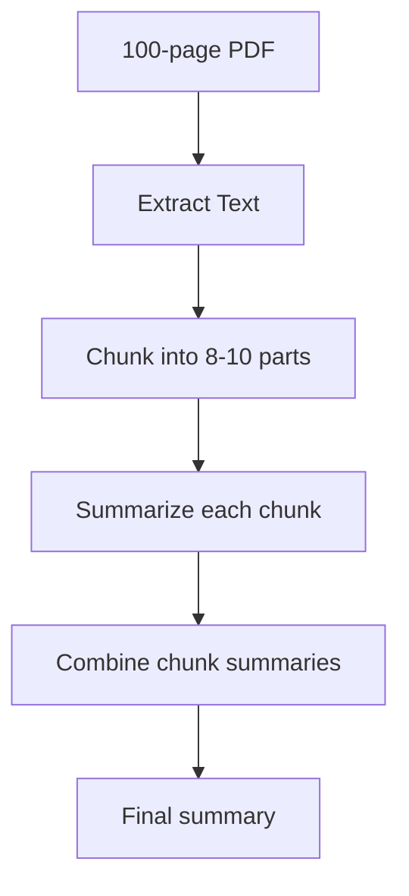

# Large PDF Handling Proposal - 100+ Pages Support

## 🚨 Vấn đề hiện tại

### Limitations:
1. **Text bị cắt ngắn**: Chỉ lấy 10,000 ký tự đầu tiên
2. **Mất context**: 100 trang PDF (~200,000 chars) → chỉ xử lý 5%
3. **Memory issues**: Load toàn bộ PDF vào RAM
4. **Single API call**: Không chia nhỏ để xử lý

## 💡 Giải pháp đề xuất

### 1. **Chunking Strategy - Chia nhỏ thông minh**

```kotlin
class PdfChunkingStrategy {
    companion object {
        const val CHUNK_SIZE = 25000 // ~5000 words per chunk
        const val OVERLAP = 1000 // Giữ context giữa chunks
    }
    
    fun chunkPdfText(fullText: String): List<TextChunk> {
        val chunks = mutableListOf<TextChunk>()
        var startIndex = 0
        var chunkNumber = 1
        
        while (startIndex < fullText.length) {
            // Find end at sentence boundary
            var endIndex = minOf(startIndex + CHUNK_SIZE, fullText.length)
            
            // Adjust to sentence boundary
            if (endIndex < fullText.length) {
                val sentenceEnd = fullText.lastIndexOf(". ", endIndex)
                if (sentenceEnd > startIndex) {
                    endIndex = sentenceEnd + 2
                }
            }
            
            chunks.add(TextChunk(
                text = fullText.substring(startIndex, endIndex),
                chunkNumber = chunkNumber++,
                startChar = startIndex,
                endChar = endIndex
            ))
            
            // Next chunk starts with overlap
            startIndex = endIndex - OVERLAP
        }
        
        return chunks
    }
}
```

### 2. **Multi-Pass Summarization**



#### Implementation:
```kotlin
suspend fun summarizeLargePdf(pdfText: String): Summary {
    // Step 1: Chunk the text
    val chunks = PdfChunkingStrategy().chunkPdfText(pdfText)
    
    // Step 2: Summarize each chunk
    val chunkSummaries = chunks.map { chunk ->
        geminiApi.summarizeText(
            prompt = "Summarize this section (part ${chunk.chunkNumber} of ${chunks.size}): ${chunk.text}",
            maxTokens = 500
        )
    }
    
    // Step 3: Create meta-summary
    val combinedSummaries = chunkSummaries.joinToString("\n\n")
    val finalSummary = geminiApi.summarizeText(
        prompt = """
            Create a comprehensive summary from these section summaries:
            $combinedSummaries
            
            Provide:
            1. Executive summary (2-3 paragraphs)
            2. Key points (bullet list)
            3. Important details by section
        """,
        maxTokens = 2000
    )
    
    return finalSummary
}
```

### 3. **Progressive Loading UI**

```kotlin
@Composable
fun PdfProcessingProgress(
    currentChunk: Int,
    totalChunks: Int,
    currentStage: ProcessingStage
) {
    Column {
        // Overall progress
        LinearProgressIndicator(
            progress = currentChunk / totalChunks.toFloat(),
            modifier = Modifier.fillMaxWidth()
        )
        
        Text(
            "Processing chunk $currentChunk of $totalChunks",
            style = MaterialTheme.typography.bodyMedium
        )
        
        // Stage indicator
        when (currentStage) {
            ProcessingStage.EXTRACTING -> "Extracting text from PDF..."
            ProcessingStage.CHUNKING -> "Dividing into sections..."
            ProcessingStage.SUMMARIZING -> "Summarizing section $currentChunk..."
            ProcessingStage.COMBINING -> "Creating final summary..."
        }
    }
}
```

### 4. **Memory-Efficient PDF Reading**

```kotlin
suspend fun extractPdfTextStreaming(
    pdfUri: Uri,
    onProgress: (Int, Int) -> Unit
): String = withContext(Dispatchers.IO) {
    val contentResolver = context.contentResolver
    val stringBuilder = StringBuilder()
    
    contentResolver.openInputStream(pdfUri)?.use { inputStream ->
        val document = PDDocument.load(inputStream)
        val totalPages = document.numberOfPages
        
        try {
            // Process pages in batches
            for (i in 0 until totalPages step 10) {
                val endPage = minOf(i + 10, totalPages)
                
                // Extract batch
                for (page in i until endPage) {
                    val text = PDFTextStripper().apply {
                        startPage = page + 1
                        endPage = page + 1
                    }.getText(document)
                    
                    stringBuilder.append(text)
                    onProgress(page + 1, totalPages)
                }
                
                // Free memory between batches
                System.gc()
            }
        } finally {
            document.close()
        }
    }
    
    return@withContext stringBuilder.toString()
}
```

### 5. **Smart Extraction Options**

```kotlin
data class PdfExtractionOptions(
    val pageRange: IntRange? = null,
    val extractionMode: ExtractionMode = ExtractionMode.FULL,
    val prioritySections: List<String> = emptyList()
)

enum class ExtractionMode {
    FULL,           // All pages
    FIRST_LAST,     // First 10 + Last 10 pages
    SMART,          // TOC + Key sections
    CUSTOM          // User selected pages
}
```

### 6. **Updated UI Flow**

```kotlin
@Composable
fun LargePdfOptionsDialog(
    pageCount: Int,
    onConfirm: (PdfExtractionOptions) -> Unit
) {
    Dialog {
        Column {
            Text("This PDF has $pageCount pages")
            
            // Extraction mode selection
            RadioGroup(
                options = listOf(
                    "Full document (may take longer)",
                    "Executive summary (first & last sections)",
                    "Smart extraction (key sections only)",
                    "Select specific pages"
                )
            )
            
            // Page range selector (if custom)
            if (selectedMode == CUSTOM) {
                RangeSlider(
                    value = selectedRange,
                    onValueChange = { ... },
                    valueRange = 1f..pageCount.toFloat()
                )
            }
            
            // Estimated time
            Text("Estimated time: ${estimateProcessingTime(pageCount, mode)}")
        }
    }
}
```

## 📊 Performance Improvements

### Before:
- 100-page PDF → Chỉ xử lý 10,000 chars (~5 pages)
- Memory spike: Load toàn bộ vào RAM
- No progress indication

### After:
- 100-page PDF → Xử lý đầy đủ qua chunks
- Memory efficient: Stream processing
- Real-time progress updates
- Partial results available

## 🚀 Implementation Roadmap

### Phase 1 (1 week):
- [ ] Implement basic chunking algorithm
- [ ] Update ProcessPdfUseCase for chunks
- [ ] Add progress UI

### Phase 2 (1 week):
- [ ] Multi-pass summarization
- [ ] Memory-efficient extraction
- [ ] Chunk caching

### Phase 3 (3 days):
- [ ] Smart extraction modes
- [ ] Page range selection
- [ ] Performance optimization

## 🎯 Benefits

1. **Handle any PDF size** - từ 1 đến 1000 trang
2. **Better summaries** - Không mất thông tin quan trọng
3. **Progressive UX** - User thấy progress, có thể cancel
4. **Memory safe** - Không crash với PDF lớn
5. **Flexible options** - User chọn được cách extract

## 🔧 Configuration

```kotlin
object LargePdfConfig {
    const val MAX_PDF_SIZE = 100 * 1024 * 1024 // 100MB
    const val MAX_PAGES = 1000
    const val CHUNK_SIZE = 25000 // chars
    const val OVERLAP_SIZE = 1000 // chars
    const val MAX_CHUNKS = 20
    const val CHUNK_SUMMARY_TOKENS = 500
    const val FINAL_SUMMARY_TOKENS = 2000
}
```

## 💡 Future Enhancements

1. **Parallel chunk processing** - Xử lý nhiều chunks cùng lúc
2. **Smart TOC parsing** - Tự động nhận diện sections
3. **Language detection** - Xử lý đa ngôn ngữ
4. **Export options** - Save chunk summaries separately
5. **Resume capability** - Tiếp tục nếu bị gián đoạn