# MERMAID DIAGRAMS
## SUMUP - BIỂU ĐỒ HỆ THỐNG

---

## 📋 MỤC LỤC

1. [System Architecture Overview](#1-system-architecture-overview)
2. [Data Flow Diagrams](#2-data-flow-diagrams)
3. [Sequence Diagrams](#3-sequence-diagrams)
4. [State Diagrams](#4-state-diagrams)
5. [Entity Relationship Diagrams](#5-entity-relationship-diagrams)
6. [Component Diagrams](#6-component-diagrams)
7. [Deployment Diagrams](#7-deployment-diagrams)

---

## 1. SYSTEM ARCHITECTURE OVERVIEW

### 1.1. Clean Architecture Layers

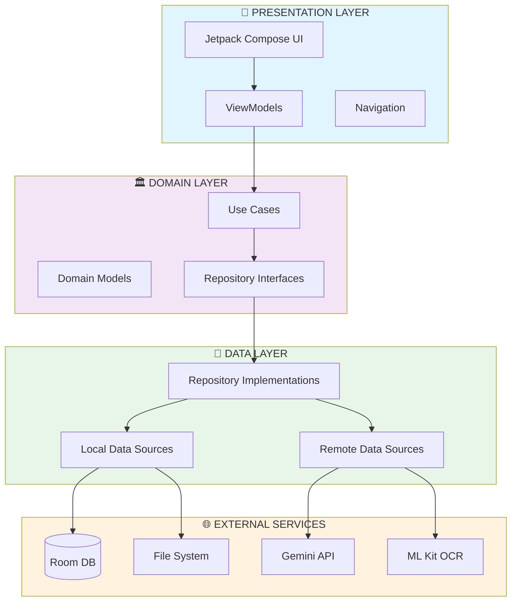

### 1.2. Module Dependencies

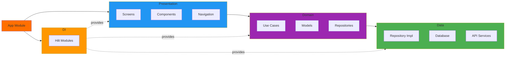

---

## 2. DATA FLOW DIAGRAMS

### 2.1. Text Summarization Flow

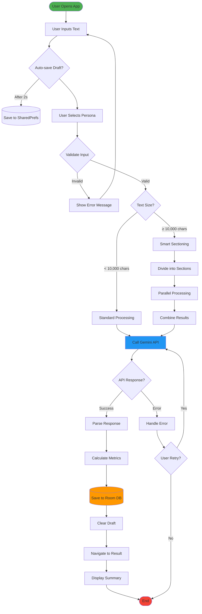

### 2.2. PDF Processing Flow

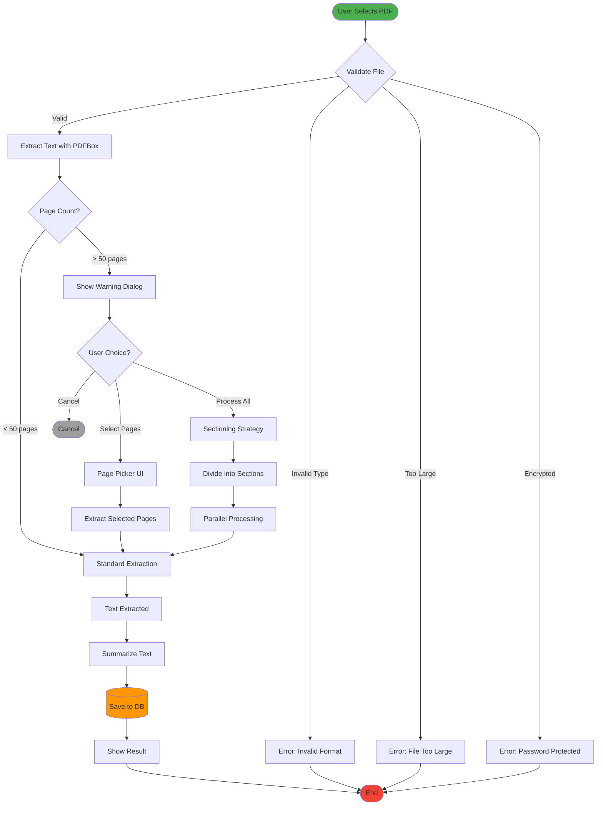

### 2.3. OCR Processing Flow

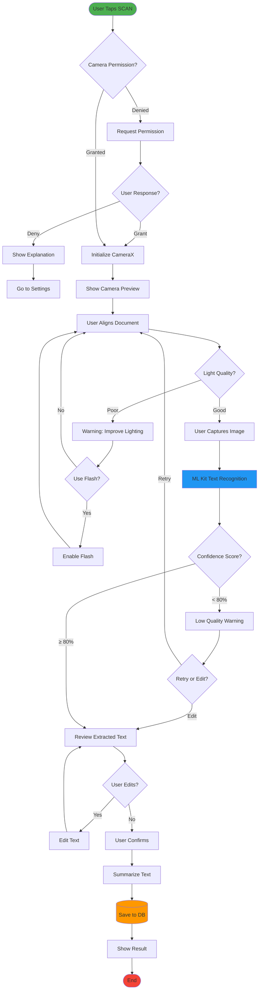

---

## 3. SEQUENCE DIAGRAMS

### 3.1. User Authentication & API Key Setup

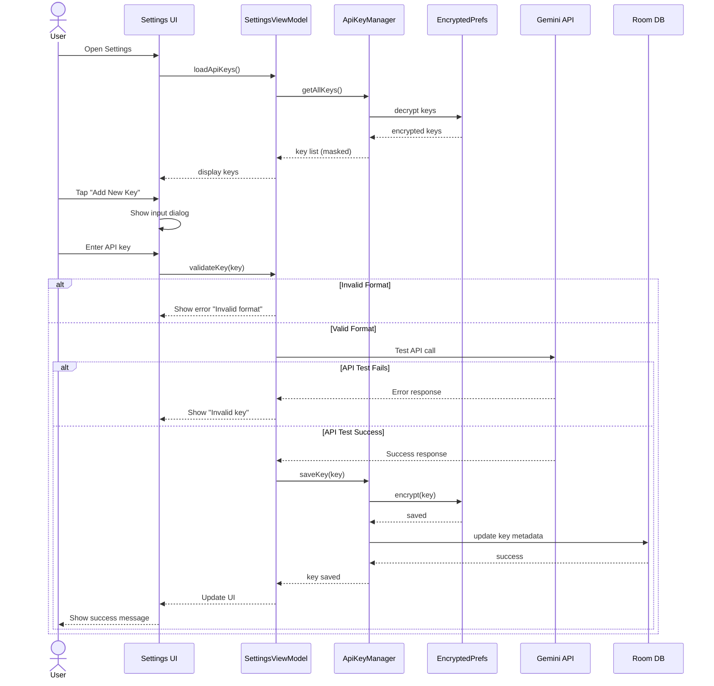

### 3.2. Text Summarization with Error Handling

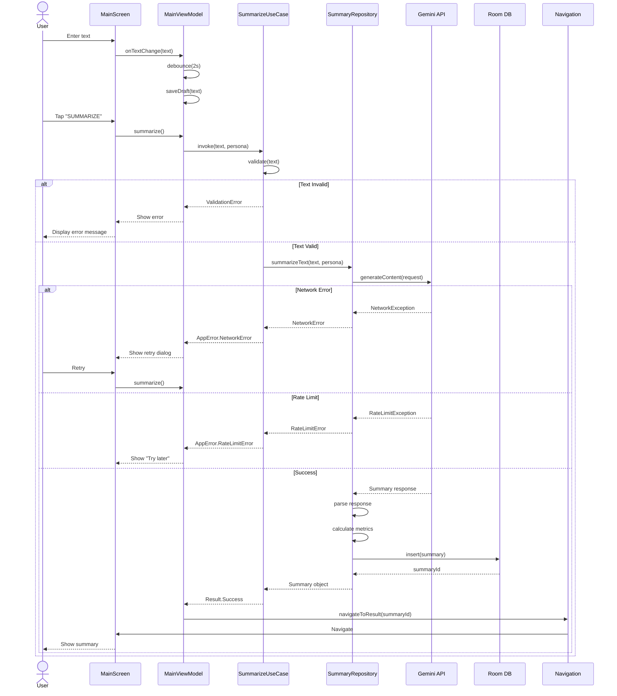

### 3.3. PDF Upload and Processing

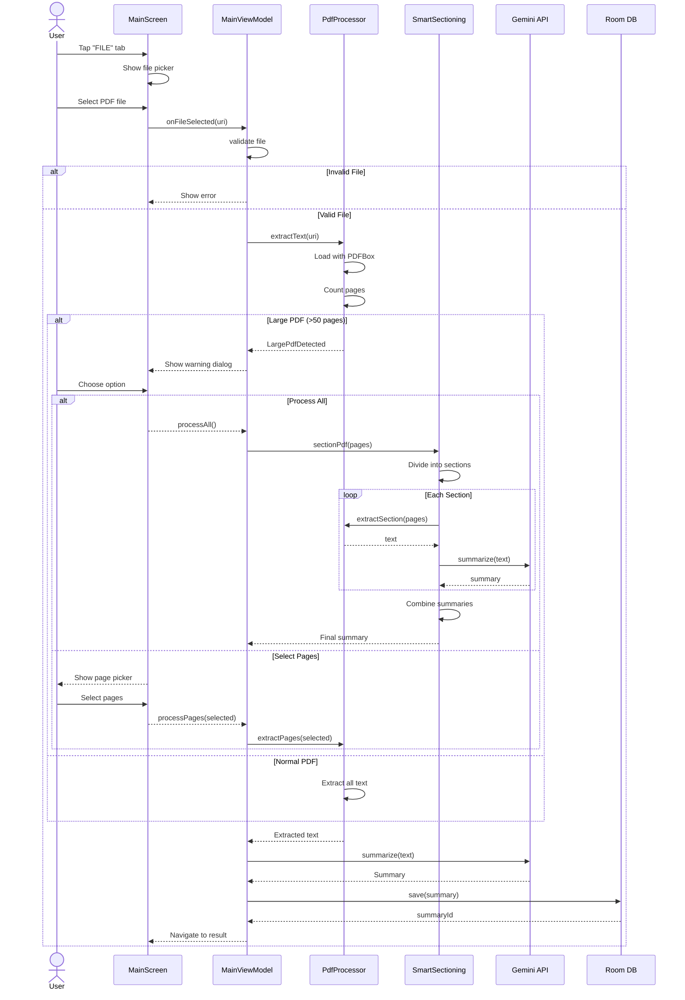

---

## 4. STATE DIAGRAMS

### 4.1. Application State Machine

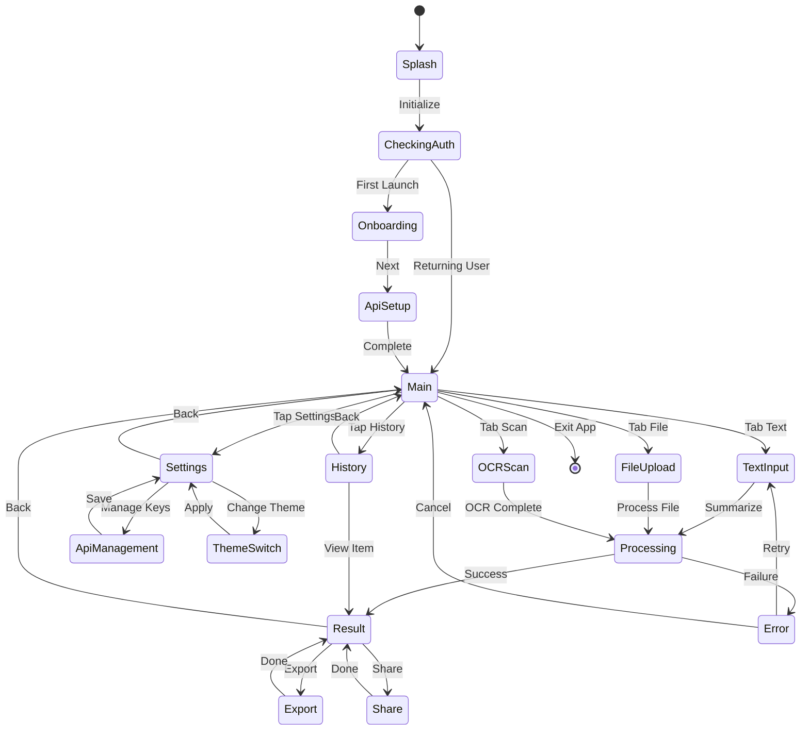

### 4.2. Summary Processing States

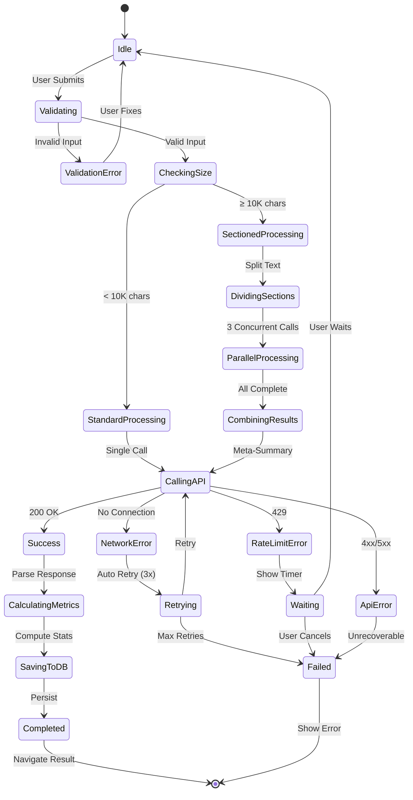

### 4.3. API Key Lifecycle

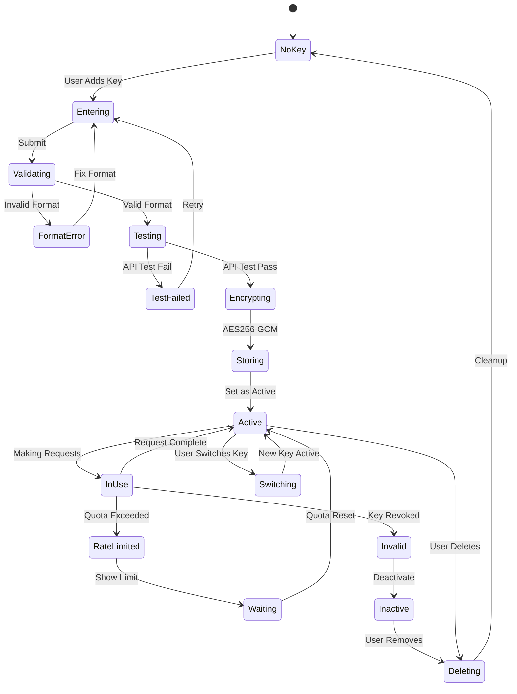

---

## 5. ENTITY RELATIONSHIP DIAGRAMS

### 5.1. Database Schema

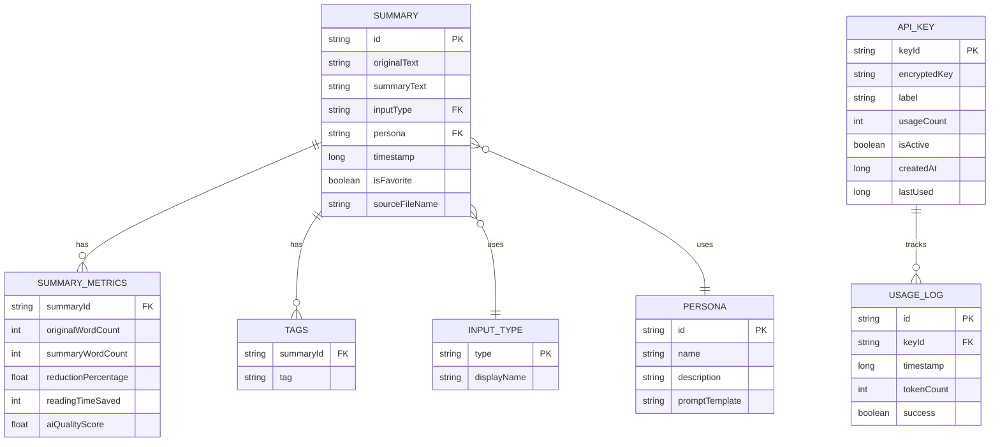

### 5.2. Data Relationships

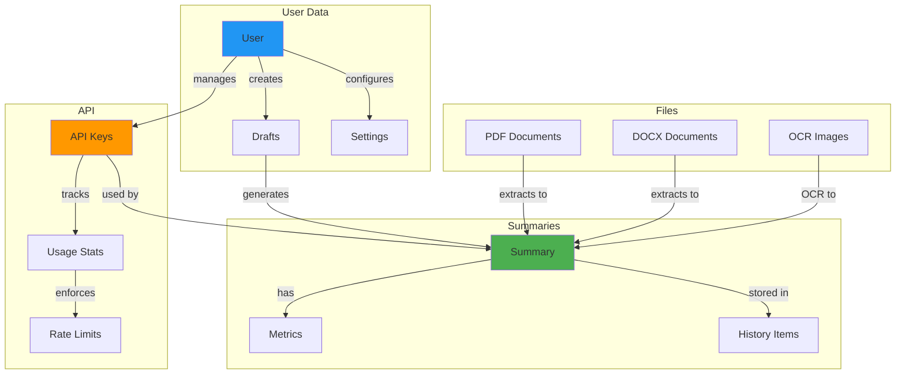

---

## 6. COMPONENT DIAGRAMS

### 6.1. Presentation Layer Components

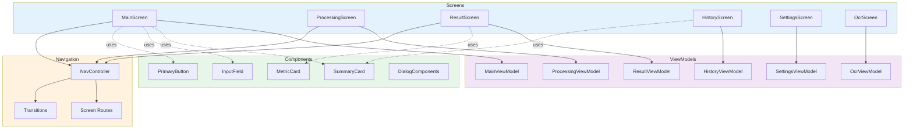

### 6.2. Domain Layer Components

```mermaid
graph TB
    subgraph Use Cases
        SUMM[SummarizeTextUseCase]
        PROC_DOC[ProcessDocumentUseCase]
        SECT[SmartSectioningUseCase]
        ADAPT[AdaptiveProcessingUseCase]
        EXPORT[ExportSummaryUseCase]
    end

    subgraph Repositories
        SUMM_REPO[SummaryRepository]
        PDF_REPO[PdfRepository]
        SET_REPO[SettingsRepository]
    end

    subgraph Models
        SUMMARY[Summary]
        ERROR[AppError]
        STATE[ProcessingState]
        METRICS[SummaryMetrics]
    end

    subgraph Document Processors
        PDF_PROC[PdfProcessor]
        DOCX_PROC[DocxProcessor]
        TXT_PROC[TxtProcessor]
        FACTORY[ProcessorFactory]
    end

    SUMM --> SUMM_REPO
    PROC_DOC --> PDF_REPO
    PROC_DOC --> FACTORY
    SECT --> SUMM_REPO
    ADAPT --> SUMM_REPO

    FACTORY --> PDF_PROC
    FACTORY --> DOCX_PROC
    FACTORY --> TXT_PROC

    SUMM -.returns.-> SUMMARY
    SUMM -.throws.-> ERROR
    PROC_DOC -.emits.-> STATE

    style "Use Cases" fill:#e1f5fe
    style Repositories fill:#f3e5f5
    style Models fill:#e8f5e9
    style "Document Processors" fill:#fff3e0
```

### 6.3. Data Layer Components

```mermaid
graph TB
    subgraph Repository Impl
        SUMM_IMPL[SummaryRepositoryImpl]
        PDF_IMPL[PdfRepositoryImpl]
        SET_IMPL[SettingsRepositoryImpl]
    end

    subgraph Local Data
        ROOM[Room Database]
        DAO[DAOs]
        ENTITY[Entities]
        CONV[Converters]
    end

    subgraph Remote Data
        API[GeminiApiService]
        ENH_API[EnhancedApiService]
        MOCK[MockApiService]
        DTO[DTOs]
    end

    subgraph Security
        ENC[EncryptedPrefs]
        AKM[ApiKeyManager]
        SEC_PROV[SecureProvider]
    end

    subgraph File Processing
        PDF_BOX[PDFBox Android]
        MAMMOTH[Mammoth DOCX]
        MLKIT[ML Kit OCR]
    end

    SUMM_IMPL --> ROOM
    SUMM_IMPL --> API
    PDF_IMPL --> PDF_BOX
    PDF_IMPL --> MAMMOTH
    SET_IMPL --> ENC

    ROOM --> DAO
    DAO --> ENTITY
    ENTITY --> CONV

    API -.fallback.-> MOCK
    API --> ENH_API
    ENH_API --> AKM
    AKM --> SEC_PROV
    SEC_PROV --> ENC

    style "Repository Impl" fill:#e3f2fd
    style "Local Data" fill:#f3e5f5
    style "Remote Data" fill:#e8f5e9
    style Security fill:#ffebee
    style "File Processing" fill:#fff3e0
```

---

## 7. DEPLOYMENT DIAGRAMS

### 7.1. Application Deployment

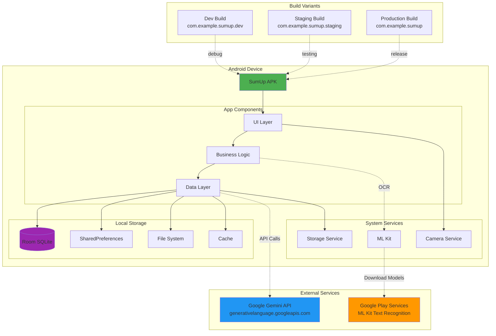

### 7.2. Network Architecture

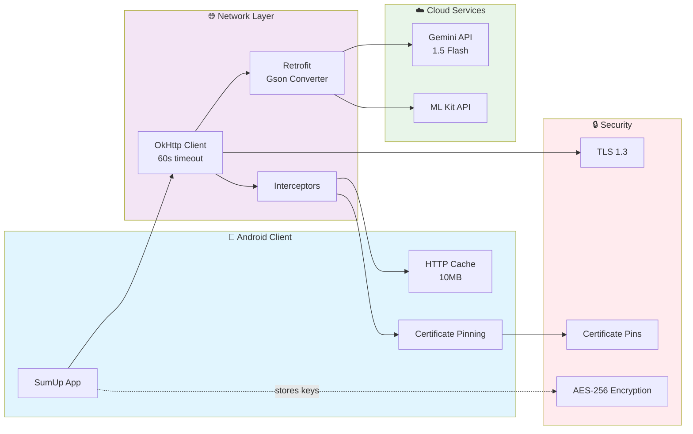

### 7.3. CI/CD Pipeline

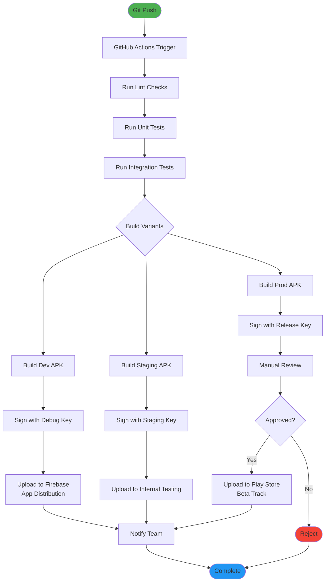

---

## 📊 DIAGRAM SUMMARY

### Tổng số Diagrams: 22

**By Category:**
- Architecture: 3 diagrams
- Data Flow: 3 diagrams
- Sequence: 3 diagrams
- State: 3 diagrams
- Entity Relationship: 2 diagrams
- Component: 3 diagrams
- Deployment: 3 diagrams
- CI/CD: 2 diagrams

**Complexity Levels:**
- Simple: 8 diagrams
- Medium: 10 diagrams
- Complex: 4 diagrams

### Rendering Instructions

**GitHub/GitLab:**
- Tất cả diagrams tự động render
- Hỗ trợ dark mode

**Markdown Viewers:**
- Cần Mermaid plugin
- VSCode: Markdown Preview Mermaid Support
- IntelliJ: Mermaid plugin

**Export Options:**
- PNG: `mermaid-cli` tool
- SVG: Mermaid Live Editor
- PDF: Via markdown-pdf

---

**📅 Ngày tạo**: January 2025
**📝 Version**: 1.0
**🎨 Tổng số Mermaid Diagrams**: 22
**✍️ Tác giả**: Team SumUp - System Architect
