# USE CASES CHI TIẾT
## SUMUP - ỨNG DỤNG TÓM TẮT VĂN BẢN THÔNG MINH

---

## 📋 MỤC LỤC USE CASES

1. [UC-001: Tóm tắt Văn bản Thủ công](#uc-001-tóm-tắt-văn-bản-thủ-công)
2. [UC-002: Upload và Xử lý PDF](#uc-002-upload-và-xử-lý-pdf)
3. [UC-003: Quét Tài liệu bằng Camera (OCR)](#uc-003-quét-tài-liệu-bằng-camera-ocr)
4. [UC-004: Xem Lịch sử Tóm tắt](#uc-004-xem-lịch-sử-tóm-tắt)
5. [UC-005: Quản lý API Key](#uc-005-quản-lý-api-key)
6. [UC-006: Export Tóm tắt](#uc-006-export-tóm-tắt)
7. [UC-007: Tìm kiếm và Lọc](#uc-007-tìm-kiếm-và-lọc)
8. [UC-008: Khôi phục Draft](#uc-008-khôi-phục-draft)
9. [UC-009: Xử lý PDF Lớn](#uc-009-xử-lý-pdf-lớn)
10. [UC-010: Thay đổi Cài đặt](#uc-010-thay-đổi-cài-đặt)

---

## UC-001: Tóm tắt Văn bản Thủ công

### Thông tin Cơ bản
- **ID**: UC-001
- **Tên**: Tóm tắt Văn bản Thủ công
- **Actor**: User (Người dùng)
- **Mô tả**: User nhập văn bản thủ công và nhận bản tóm tắt từ AI
- **Tiền điều kiện**:
  - App đã được cài đặt
  - Có kết nối internet (hoặc dùng mock API)
- **Hậu điều kiện**:
  - Văn bản được tóm tắt thành công
  - Kết quả được lưu vào lịch sử

### Luồng Chính (Main Flow)

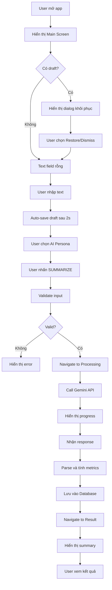

### Các Bước Chi Tiết

| Bước | Actor | Hành động | Hệ thống |
|------|-------|-----------|----------|
| 1 | User | Mở ứng dụng SumUp | Kiểm tra draft đã lưu |
| 2 | System | - | Hiển thị Main Screen |
| 3 | System | - | Nếu có draft: Hiển thị dialog "Khôi phục draft?" |
| 4 | User | Chọn Restore hoặc Dismiss | - |
| 5 | User | Nhập văn bản vào text field | - |
| 6 | System | - | Auto-save draft sau 2 giây |
| 7 | System | - | Hiển thị character counter |
| 8 | User | Chọn AI Persona từ dropdown | - |
| 9 | User | Nhấn button "SUMMARIZE" | - |
| 10 | System | - | Validate input (length, format) |
| 11 | System | - | Navigate to Processing Screen |
| 12 | System | - | Gọi Gemini API với text + persona |
| 13 | System | - | Hiển thị progress animation |
| 14 | System | - | Nhận response từ API |
| 15 | System | - | Parse response, tính metrics |
| 16 | System | - | Lưu summary vào Room Database |
| 17 | System | - | Navigate to Result Screen |
| 18 | System | - | Hiển thị summary + metrics |
| 19 | User | Xem kết quả | - |

### Luồng Thay thế (Alternative Flows)

**Alt 1: Text quá ngắn**
```
10a. System phát hiện text < 10 ký tự
10b. Hiển thị error: "Text too short for summarization"
10c. Focus vào text field
10d. Quay lại bước 5
```

**Alt 2: Text quá dài (>5,000 chars)**
```
10a. System phát hiện text > 5,000 chars
10b. Hiển thị warning dialog
10c. User chọn: Trim hoặc Cancel
10d. Nếu Trim: Cắt text xuống 5,000 chars, tiếp tục bước 11
10e. Nếu Cancel: Quay lại bước 5
```

**Alt 3: Không có kết nối mạng**
```
12a. System phát hiện không có network
12b. Hiển thị error: "No internet connection"
12c. Đề xuất: Retry hoặc Use offline mode
12d. Nếu Retry: Kiểm tra lại network, quay lại bước 12
12e. Nếu Offline: Sử dụng cached data (nếu có)
```

**Alt 4: API rate limit**
```
14a. API trả về error 429 (Too Many Requests)
14b. Hiển thị error: "Rate limit reached"
14c. Hiển thị thời gian reset (ví dụ: "Try again in 5 minutes")
14d. User có thể Cancel hoặc Wait
```

### Exception Flows

**Exc 1: API timeout**
```
13a. API không response sau 60s
13b. System cancel request
13c. Hiển thị error: "Request timeout"
13d. Đề xuất Retry
```

**Exc 2: Invalid API key**
```
12a. API key không hợp lệ
12b. Hiển thị error: "Invalid API key"
12c. Navigate to Settings để cấu hình key mới
```

### Post-conditions
- ✅ Summary được lưu trong Database
- ✅ Draft được xóa (nếu tóm tắt thành công)
- ✅ User có thể view, copy, export kết quả

### Acceptance Criteria (AC)

**AC-001.1: Input Validation**
- ✅ System accepts text từ 10 đến 5,000 ký tự
- ✅ Character counter hiển thị real-time
- ✅ Warning message xuất hiện khi text < 10 hoặc > 5,000 chars
- ✅ Summarize button disabled khi input invalid

**AC-001.2: Processing Performance**
- ✅ Summary generation completes trong 5 giây (95th percentile)
- ✅ Processing screen hiển thị trong 200ms sau khi tap Summarize
- ✅ Progress animation smooth (60 FPS)
- ✅ User có thể cancel processing bất kỳ lúc nào

**AC-001.3: Summary Quality**
- ✅ Summary word count giảm ít nhất 40% so với original
- ✅ Summary không chứa hallucinations (verified bằng context)
- ✅ Metrics tính toán chính xác (word count, reduction %, reading time)
- ✅ AI quality score hiển thị (nếu available)

**AC-001.4: Data Persistence**
- ✅ Summary được lưu vào Room Database ngay sau generation
- ✅ Timestamp chính xác (±1 second)
- ✅ Persona được lưu kèm theo summary
- ✅ Draft được xóa tự động sau khi summarize thành công

**AC-001.5: Error Handling**
- ✅ Network error hiển thị với retry option
- ✅ API rate limit hiển thị thời gian reset còn lại
- ✅ Invalid API key redirect to Settings
- ✅ Timeout error (>60s) hiển thị với clear message

**AC-001.6: UI/UX Requirements**
- ✅ Draft recovery dialog hiển thị trong 500ms khi mở app
- ✅ Persona dropdown hiển thị 6 options
- ✅ Haptic feedback khi tap Summarize
- ✅ Result screen animation mượt mà
- ✅ Back navigation bảo toàn draft

---

## UC-002: Upload và Xử lý PDF

### Thông tin Cơ bản
- **ID**: UC-002
- **Tên**: Upload và Xử lý PDF
- **Actor**: User
- **Mô tả**: User upload file PDF và nhận bản tóm tắt nội dung
- **Tiền điều kiện**:
  - PDF file tồn tại trên thiết bị
  - File size ≤ 10MB
  - Format hợp lệ (.pdf)

### Mermaid Diagram

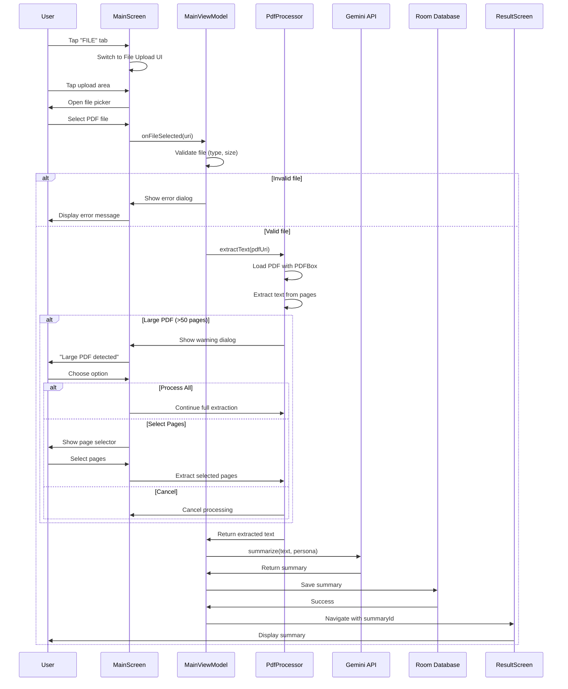

### Các Bước Chi Tiết

1. **User chọn tab FILE**
2. **System hiển thị file upload UI**
3. **User tap vào upload area**
4. **System mở file picker**
5. **User chọn PDF file**
6. **System validate file**:
   - Check extension (.pdf)
   - Check size (max 10MB)
   - Check readability
7. **System bắt đầu extraction**:
   - Hiển thị progress bar
   - Load PDF với PDFBox
   - Extract text từng page
8. **Nếu PDF lớn (>50 pages)**:
   - Hiển thị warning dialog
   - Options: Process All / Select Pages / Cancel
9. **System xử lý theo lựa chọn**
10. **System gọi API để tóm tắt**
11. **System lưu kết quả vào DB**
12. **System navigate to Result Screen**

### Alternative Flows

**Alt 1: File không phải PDF**
```
6a. System phát hiện extension không phải .pdf
6b. Hiển thị error: "Only PDF files are supported"
6c. Quay lại bước 3
```

**Alt 2: File quá lớn (>10MB)**
```
6a. System phát hiện size > 10MB
6b. Hiển thị warning: "File too large. Max 10MB allowed"
6c. Đề xuất: Compress PDF hoặc Select different file
```

**Alt 3: PDF bị mã hóa/password protected**
```
7a. PDFBox không thể load file (encrypted)
7b. Hiển thị error: "PDF is password protected"
7c. Đề xuất: Remove password hoặc Use different file
```

### Acceptance Criteria (AC)

**AC-002.1: File Validation**
- ✅ System chỉ accept files với extension .pdf
- ✅ Maximum file size: 10MB
- ✅ Error message rõ ràng khi file invalid
- ✅ File picker chỉ hiển thị PDF files

**AC-002.2: PDF Extraction**
- ✅ PDFBox extract text thành công từ standard PDFs
- ✅ Support PDFs up to 200 pages
- ✅ Extraction preserves paragraph structure
- ✅ Handle scanned PDFs (image-based) gracefully

**AC-002.3: Large PDF Handling**
- ✅ Warning dialog xuất hiện khi PDF > 50 pages
- ✅ User có 3 options: Process All / Select Pages / Cancel
- ✅ Page selector UI hiển thị preview thumbnails
- ✅ Selected pages extraction works correctly

**AC-002.4: Processing Progress**
- ✅ Progress bar hiển thị extraction progress (0-100%)
- ✅ Progress updates mỗi page extracted
- ✅ Estimated time remaining hiển thị
- ✅ User có thể cancel bất kỳ lúc nào

**AC-002.5: Performance**
- ✅ Extract < 1 second per page (standard text PDFs)
- ✅ Memory usage < 200MB cho PDFs up to 50 pages
- ✅ No memory leaks sau khi processing
- ✅ Background thread không block UI

**AC-002.6: Error Handling**
- ✅ Encrypted/password-protected PDF detected và báo lỗi
- ✅ Corrupted PDF detected và báo lỗi
- ✅ Out of memory error handled gracefully
- ✅ File not found error handled

---

## UC-003: Quét Tài liệu bằng Camera (OCR)

### Thông tin Cơ bản
- **ID**: UC-003
- **Tên**: Quét Tài liệu bằng Camera (OCR)
- **Actor**: User
- **Mô tả**: User chụp ảnh tài liệu, OCR text, và tóm tắt
- **Tiền điều kiện**:
  - Camera permission granted
  - Đủ ánh sáng để chụp
  - ML Kit Text Recognition available

### Flow Diagram

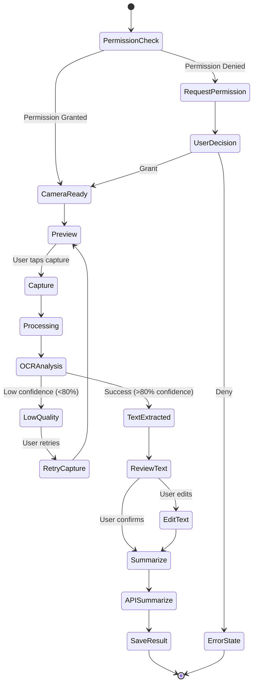

### Các Bước Chi Tiết

| Bước | Actor | Hành động | Hệ thống |
|------|-------|-----------|----------|
| 1 | User | Tap tab "SCAN" | Kiểm tra camera permission |
| 2 | System | - | Request permission nếu chưa có |
| 3 | User | Grant permission | - |
| 4 | System | - | Initialize CameraX |
| 5 | System | - | Hiển thị camera preview |
| 6 | System | - | Hiển thị document frame overlay |
| 7 | User | Align document trong frame | - |
| 8 | System | - | Auto-detect document boundaries (optional) |
| 9 | User | Tap capture button | - |
| 10 | System | - | Capture image |
| 11 | System | - | Process với ML Kit Text Recognition |
| 12 | System | - | Hiển thị progress "Analyzing..." |
| 13 | System | - | Extract text từ image |
| 14 | System | - | Calculate confidence score |
| 15 | System | - | Hiển thị extracted text để review |
| 16 | User | Review và edit nếu cần | - |
| 17 | User | Tap "SUMMARIZE" | - |
| 18 | System | - | Gọi API với extracted text |
| 19 | System | - | Lưu summary vào DB |
| 20 | System | - | Navigate to Result |

### Alternative Flows

**Alt 1: Permission bị từ chối**
```
3a. User deny camera permission
3b. Hiển thị explanation dialog
3c. Options: Go to Settings / Cancel
3d. Nếu Settings: Mở app settings
```

**Alt 2: Ánh sáng yếu**
```
7a. System detect low light (ML Kit confidence < 50%)
7b. Show warning: "Improve lighting"
7c. Suggest: Turn on flash / Move to brighter area
7d. User có thể toggle flash
```

**Alt 3: OCR confidence thấp (<80%)**
```
14a. Confidence score < 80%
14b. Hiển thị warning: "Text quality may be low"
14c. Show extracted text với highlight uncertain parts
14d. User có thể: Retry capture / Edit text / Continue anyway
```

**Alt 4: Không detect được text**
```
13a. ML Kit không tìm thấy text trong image
13b. Hiển thị error: "No text detected"
13c. Suggest: Retake / Use different input method
```

### Acceptance Criteria (AC)

**AC-003.1: Permission Management**
- ✅ Camera permission request hiển thị với clear explanation
- ✅ Permission denial hiển thị rationale dialog
- ✅ "Go to Settings" button mở App Info settings
- ✅ Permission granted → Camera initializes trong 1 giây

**AC-003.2: Camera Functionality**
- ✅ Camera preview hiển thị full screen
- ✅ Document frame overlay hiển thị rõ ràng
- ✅ Flash toggle works correctly
- ✅ Gallery picker available như fallback option
- ✅ Capture button responsive (<100ms lag)

**AC-003.3: OCR Accuracy**
- ✅ ML Kit Text Recognition confidence score ≥ 80% cho clear text
- ✅ Support multiple languages (EN, VI)
- ✅ Extracted text preserves line breaks và formatting
- ✅ Low confidence (<80%) hiển thị warning

**AC-003.4: Image Quality**
- ✅ Low light warning khi confidence < 50%
- ✅ Blur detection và warning
- ✅ Suggested flash toggle khi light insufficient
- ✅ Image resolution ≥ 1080p for OCR processing

**AC-003.5: Text Review**
- ✅ Extracted text hiển thị trong editable field
- ✅ User có thể edit text trước khi summarize
- ✅ Character count displayed
- ✅ Retry option available

**AC-003.6: Performance**
- ✅ OCR processing completes trong 3 giây
- ✅ No camera freeze hoặc lag
- ✅ Memory efficient (< 150MB usage)
- ✅ Image cleanup sau processing

---

## UC-004: Xem Lịch sử Tóm tắt

### Mermaid Diagram

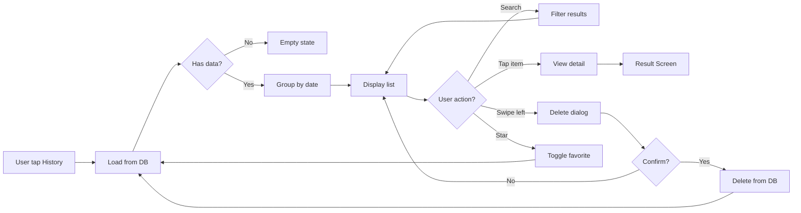

### Các Bước

1. User tap icon "History"
2. System query DB: `getAllSummaries()`
3. System group theo date (Today, Yesterday, This week, etc.)
4. System hiển thị list với sections
5. User có thể:
   - Search: Real-time filter
   - Swipe: Delete action
   - Tap: View detail
   - Star: Toggle favorite
6. System update DB khi có thay đổi

### Acceptance Criteria (AC)

**AC-004.1: Data Loading**
- ✅ History loads trong 500ms (cho < 100 items)
- ✅ Empty state hiển thị với helpful illustration
- ✅ Shimmer loading effect khi fetching data
- ✅ Pagination loads 20 items at a time

**AC-004.2: Grouping & Display**
- ✅ Summaries grouped by: Today, Yesterday, This Week, Older
- ✅ Each item hiển thị: title, word count, timestamp, persona
- ✅ Favorite items có star icon
- ✅ List scrolls smoothly (60 FPS)

**AC-004.3: Search Functionality**
- ✅ Real-time search với fuzzy matching
- ✅ Search debounce 300ms
- ✅ Search across original text và summary text
- ✅ Clear button resets search

**AC-004.4: Swipe Actions**
- ✅ Swipe left reveals delete option
- ✅ Swipe right reveals favorite toggle
- ✅ Haptic feedback on swipe
- ✅ Confirmation dialog before delete

**AC-004.5: Navigation**
- ✅ Tap item navigates to Result screen
- ✅ Result screen loads trong 200ms
- ✅ Back navigation returns to same scroll position
- ✅ Deep linking works (history/{id})

---

## UC-005: Quản lý API Key

### Flow Diagram

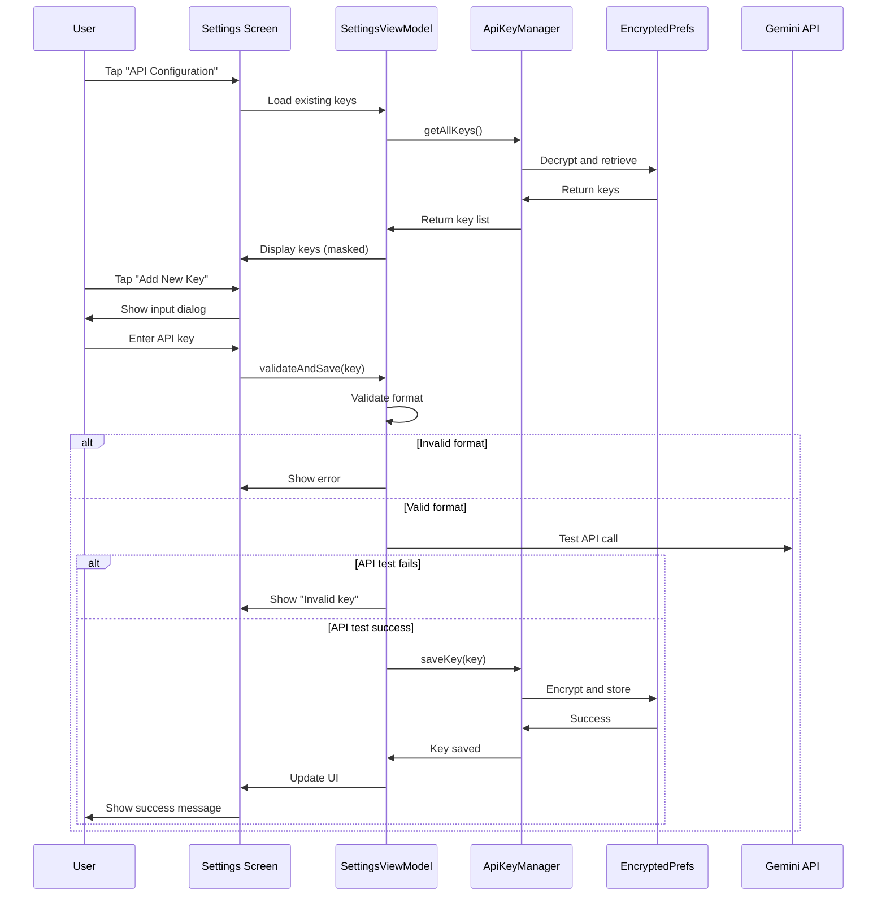

### Các Bước Chi Tiết

1. **User navigate to Settings**
2. **System hiển thị existing API keys** (masked)
3. **User tap "Add New Key"**
4. **System show input dialog**
5. **User nhập API key**
6. **System validate format**:
   - Check prefix "AIza"
   - Check length (39 chars)
7. **System test API key** (optional):
   - Make test API call
   - Verify response
8. **System encrypt key**:
   - Use AES256-GCM
   - Store in EncryptedSharedPreferences
9. **System set as active key**
10. **System update UI với success message**

### Security Considerations

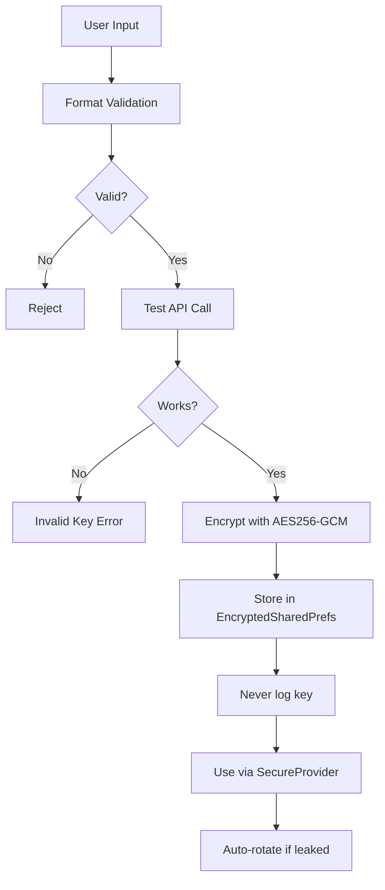

### Acceptance Criteria (AC)

**AC-005.1: API Key Format Validation**
- ✅ Accept keys starting with "AIza"
- ✅ Validate length (39 characters)
- ✅ Reject keys với invalid characters
- ✅ Real-time validation feedback

**AC-005.2: API Key Testing**
- ✅ Test API call completes trong 5 giây
- ✅ Success: Key marked as valid
- ✅ Failure: Clear error message (Invalid/Network/Other)
- ✅ Test call uses minimal quota (1 token)

**AC-005.3: Encryption & Storage**
- ✅ Keys encrypted với AES256-GCM
- ✅ Stored in EncryptedSharedPreferences
- ✅ Never logged hoặc exposed in crashes
- ✅ Secure memory cleanup sau use

**AC-005.4: Key Management UI**
- ✅ List hiển thị masked keys (AIza****xyz)
- ✅ Active key highlighted
- ✅ Usage stats hiển thị (X/60 requests per minute)
- ✅ Delete confirmation dialog

**AC-005.5: Multi-key Support**
- ✅ Support multiple API keys
- ✅ Switch active key instantly
- ✅ Auto-rotate khi rate limit hit
- ✅ Labels for keys (Personal, Work, etc.)

**AC-005.6: Security Requirements**
- ✅ No API key in BuildConfig for release builds
- ✅ Keys không sync to cloud backups
- ✅ Revoked keys detected và removed
- ✅ Secure input field (no copy/paste logging)

---

## UC-006: Export Tóm tắt

### Export Options

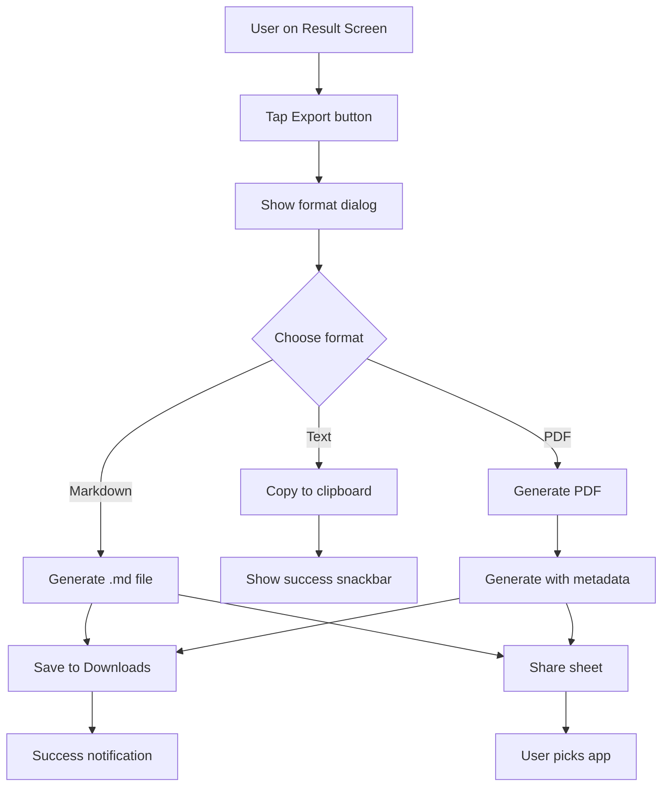

### Export Formats

**1. Plain Text**
```
Original: [original text]
Summary: [summary text]
Persona: General
Words: 500 → 100 (80% reduction)
Time saved: 3 minutes
```

**2. Markdown**
```markdown
# Summary Report

## Original Text
[original text...]

## Summary
[summary text...]

## Metrics
- Original: 500 words
- Summary: 100 words
- Reduction: 80%
- Persona: General
- Generated: 2025-01-15 10:30
```

**3. PDF**
- Header với logo SumUp
- Metadata (date, persona, metrics)
- Original text (optional)
- Summary text
- Footer với app info

### Acceptance Criteria (AC)

**AC-006.1: Export Formats**
- ✅ Support 3 formats: Plain Text, Markdown, PDF
- ✅ Format selection dialog hiển thị với previews
- ✅ Each format includes metadata (date, persona, metrics)
- ✅ File naming convention: "Summary_YYYY-MM-DD_HH-MM.ext"

**AC-006.2: Plain Text Export**
- ✅ Copy to clipboard với haptic feedback
- ✅ Success snackbar hiển thị
- ✅ Clipboard data persists sau app close
- ✅ Formatted với line breaks preserved

**AC-006.3: Markdown Export**
- ✅ Valid markdown syntax
- ✅ Includes heading levels (H1, H2)
- ✅ Metrics in bullet list format
- ✅ Code blocks for original text (optional)

**AC-006.4: PDF Export**
- ✅ PDF generation completes trong 3 giây
- ✅ File saved to Downloads folder
- ✅ PDF readable in standard viewers
- ✅ File size < 1MB

**AC-006.5: Share Functionality**
- ✅ Android Share Sheet mở với exported file
- ✅ Support sharing to: Email, Drive, Messaging
- ✅ Temporary files cleaned up sau share
- ✅ Share intent includes proper MIME type

**AC-006.6: Error Handling**
- ✅ Storage permission handled
- ✅ Disk full error detected
- ✅ Export failure shows retry option
- ✅ Success notification với "Open file" action

---

## UC-007: Tìm kiếm và Lọc

### Search Flow

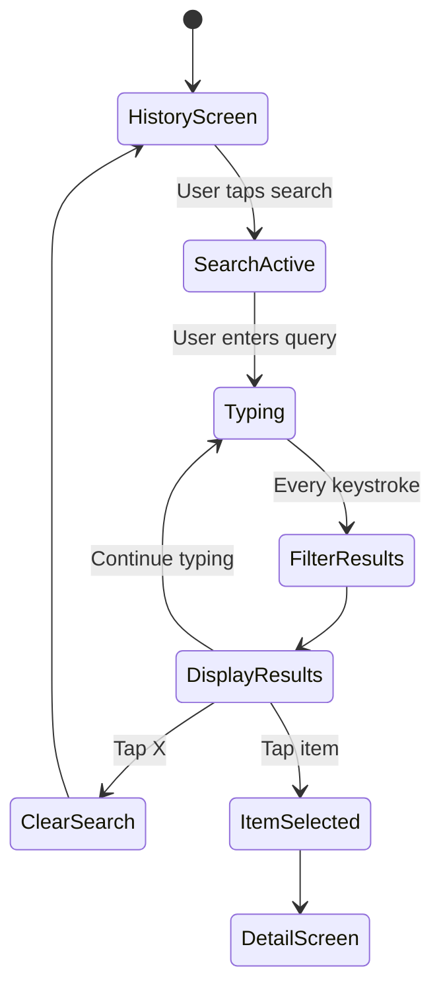

### Filter Options

**By Date:**
- Today
- Yesterday
- Last 7 days
- Last 30 days
- Custom range

**By Persona:**
- General
- Student
- Professional
- Academic
- Creative
- Quick Brief

**By Input Type:**
- Text
- PDF
- DOCX
- OCR

**By Status:**
- All
- Favorites only

### Acceptance Criteria (AC)

**AC-007.1: Search Functionality**
- ✅ Real-time search với 300ms debounce
- ✅ Fuzzy matching (tolerates typos)
- ✅ Search across: original text, summary, tags
- ✅ Highlight matching keywords trong results
- ✅ Search persists across screen rotations

**AC-007.2: Filter Options**
- ✅ Date filter: Today, Yesterday, Last 7/30 days, Custom range
- ✅ Persona filter: All 6 personas selectable
- ✅ Input type filter: TEXT, PDF, DOCX, OCR
- ✅ Favorites toggle filter
- ✅ Filters combinable (AND logic)

**AC-007.3: Performance**
- ✅ Filter results hiển thị trong 200ms
- ✅ Search handles 1000+ items smoothly
- ✅ No UI lag khi typing
- ✅ Database queries optimized với indexes

**AC-007.4: UI/UX**
- ✅ Active filters hiển thị as chips
- ✅ Clear all filters button available
- ✅ Result count displayed ("15 results")
- ✅ Empty state khi no results found

**AC-007.5: State Management**
- ✅ Search query và filters persist when navigating away
- ✅ Clear search button resets to all results
- ✅ Filter state saved across app restarts (optional)

---

## UC-008: Khôi phục Draft

### Auto-save Flow

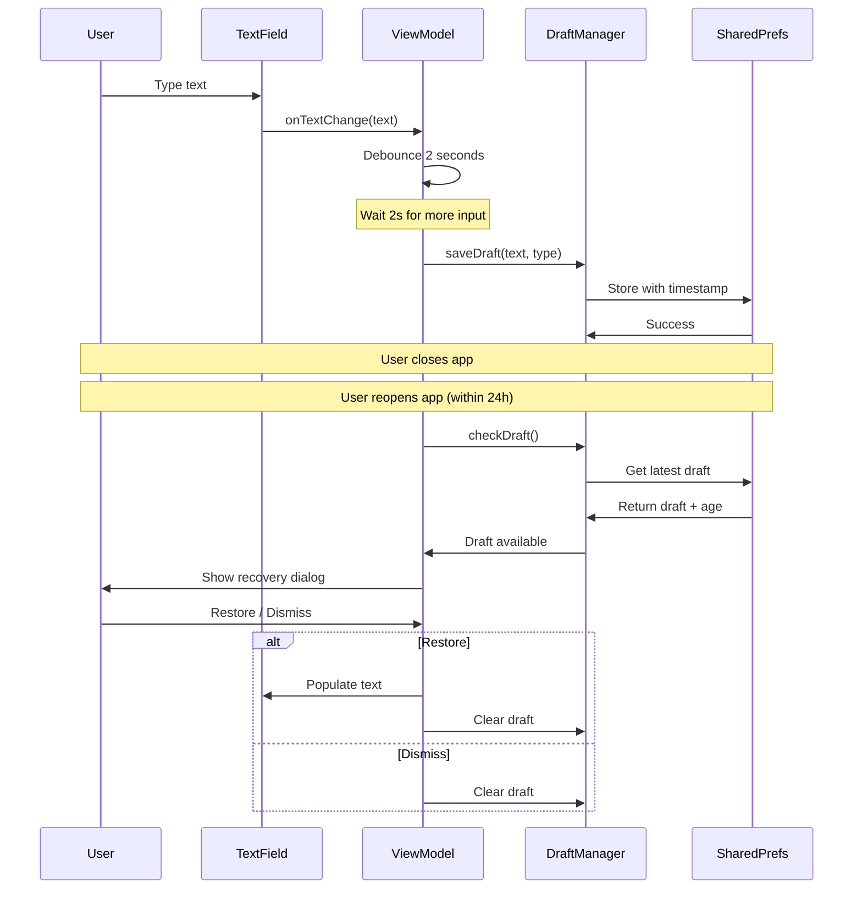

### Draft Lifecycle

**Save Conditions:**
- Text length > 10 chars
- 2 seconds debounce
- Input type stored
- Timestamp saved

**Recovery Conditions:**
- Draft age < 24 hours
- App restart detected
- Draft not already restored

**Clear Conditions:**
- Successfully summarized
- User dismisses
- Draft expired (>24h)
- User clears manually

### Acceptance Criteria (AC)

**AC-008.1: Auto-save Behavior**
- ✅ Draft saves 2 seconds sau last keystroke (debounce)
- ✅ Minimum text length: 10 characters
- ✅ Saves input type (TEXT/PDF/OCR)
- ✅ Timestamp stored accurately
- ✅ No network required (local storage)

**AC-008.2: Recovery Dialog**
- ✅ Dialog hiển thị trong 500ms khi app opens
- ✅ Shows draft preview (first 100 characters)
- ✅ Shows draft age ("5 minutes ago")
- ✅ Two buttons: Restore / Dismiss
- ✅ Dismissable by tapping outside

**AC-008.3: Restore Functionality**
- ✅ Text populated instantly (<100ms)
- ✅ Cursor positioned at end of text
- ✅ Input type tab switched accordingly
- ✅ Draft cleared sau restore
- ✅ Success feedback (subtle animation)

**AC-008.4: Draft Expiration**
- ✅ Drafts older than 24h auto-deleted
- ✅ Expired drafts không hiển thị recovery dialog
- ✅ Cleanup runs on app start
- ✅ Storage limit: 1 draft per input type

**AC-008.5: Edge Cases**
- ✅ Multiple rapid text changes handled (debounce)
- ✅ App kill during save doesn't corrupt draft
- ✅ Draft survives app updates
- ✅ No draft conflict khi multiple instances

---

## UC-009: Xử lý PDF Lớn

### Large PDF Strategy

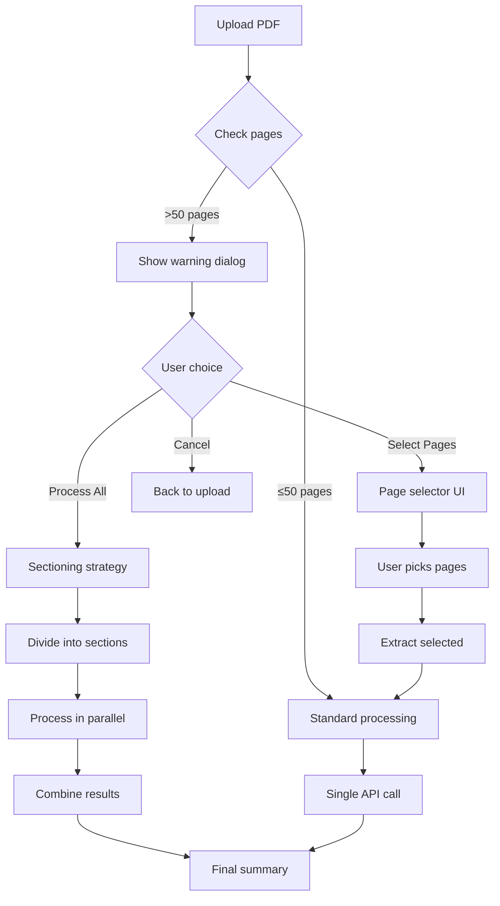

### Sectioning Algorithm

**Input:** PDF with N pages (N > 50)

**Steps:**
1. Calculate sections: `ceil(N / 20)` (max 20 pages per section)
2. Extract text từng section
3. Parallel process sections (max 3 concurrent)
4. Each section → API call
5. Combine summaries với meta-summary
6. Calculate aggregate metrics

**Example:**
- 65 pages → 4 sections (20+20+20+5)
- 4 API calls (3 parallel + 1)
- 1 meta-summary call
- Total time: ~10-12s

### Acceptance Criteria (AC)

**AC-009.1: Large PDF Detection**
- ✅ Warning dialog xuất hiện khi PDF > 50 pages
- ✅ Dialog shows page count và estimated time
- ✅ 3 options clearly presented: Process All / Select Pages / Cancel
- ✅ User choice persists cho session

**AC-009.2: Page Selection**
- ✅ Page selector UI shows thumbnails (nếu possible)
- ✅ Multi-select functionality works
- ✅ Page range input available (e.g., "1-10, 20-30")
- ✅ Validation cho page numbers
- ✅ Selected pages highlighted

**AC-009.3: Sectioning Strategy**
- ✅ PDF divided into 20-page sections
- ✅ Sections processed in parallel (max 3 concurrent)
- ✅ Progress bar shows section progress
- ✅ Each section summarized independently

**AC-009.4: Meta-summary**
- ✅ Section summaries combined intelligently
- ✅ Meta-summary removes redundancy
- ✅ Overall metrics calculated correctly
- ✅ Final summary coherent và readable

**AC-009.5: Performance**
- ✅ 65-page PDF processed trong 15 giây (with sectioning)
- ✅ Memory usage < 300MB during processing
- ✅ No memory leaks sau processing
- ✅ Progress updates mỗi 2 seconds

**AC-009.6: Error Handling**
- ✅ Section processing failure doesn't crash entire operation
- ✅ Failed sections retried once
- ✅ Partial results available nếu some sections fail
- ✅ Clear error messages cho failures

---

## UC-010: Thay đổi Cài đặt

### Settings Categories

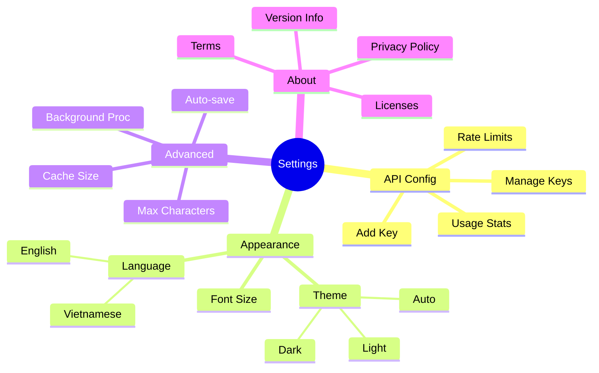

### Theme Switching Flow

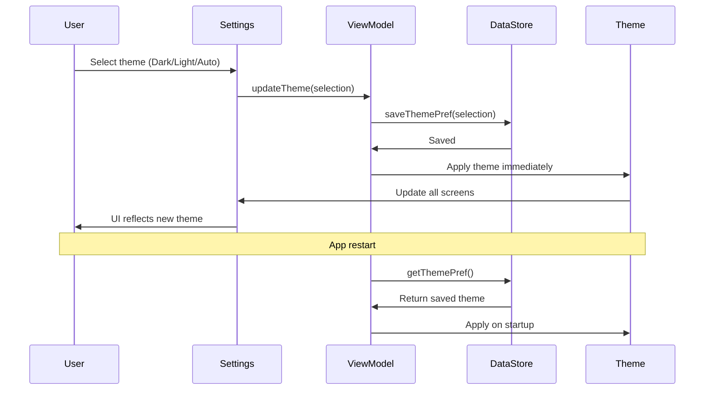

### Acceptance Criteria (AC)

**AC-010.1: Theme Settings**
- ✅ 3 theme options: Dark, Light, Auto (system)
- ✅ Theme applies immediately (no restart required)
- ✅ All screens updated instantly
- ✅ Theme preference saved in DataStore
- ✅ Auto theme follows system settings

**AC-010.2: Language Settings**
- ✅ 2 languages: English, Vietnamese
- ✅ Language switch applies to all strings
- ✅ No missing translations
- ✅ Right-to-left (RTL) support (nếu needed)
- ✅ Language persists across restarts

**AC-010.3: Advanced Settings**
- ✅ Max characters slider: 1,000 - 10,000
- ✅ Auto-save toggle works immediately
- ✅ Background processing toggle with explanation
- ✅ Cache size displayed và clearable
- ✅ All settings have descriptive labels

**AC-010.4: API Configuration**
- ✅ API key management integrated
- ✅ Usage stats hiển thị real-time
- ✅ Rate limit progress bar
- ✅ Multiple keys supported
- ✅ Test API key functionality available

**AC-010.5: About Section**
- ✅ Version info accurate (matches build.gradle)
- ✅ Privacy Policy link opens browser
- ✅ Terms of Service link works
- ✅ Open source licenses displayed
- ✅ Credits to team members

**AC-010.6: Data Management**
- ✅ Clear cache confirmation dialog
- ✅ Export data option available
- ✅ Reset to defaults confirmation
- ✅ Settings backup/restore (optional)

---

## 📊 USE CASE PRIORITY

### High Priority (Must Have)
- ✅ UC-001: Tóm tắt Văn bản Thủ công
- ✅ UC-002: Upload và Xử lý PDF
- ✅ UC-004: Xem Lịch sử Tóm tắt
- ✅ UC-005: Quản lý API Key

### Medium Priority (Should Have)
- ✅ UC-003: Quét Tài liệu bằng Camera (OCR)
- ✅ UC-006: Export Tóm tắt
- ✅ UC-007: Tìm kiếm và Lọc
- ✅ UC-009: Xử lý PDF Lớn

### Low Priority (Nice to Have)
- ✅ UC-008: Khôi phục Draft
- ✅ UC-010: Thay đổi Cài đặt

---

## 🎯 TRACEABILITY MATRIX

| Use Case | Requirements | Architecture | Test Cases |
|----------|--------------|--------------|------------|
| UC-001 | REQ-001, REQ-002 | MainViewModel, SummarizeTextUseCase | TC-001 ~ TC-015 |
| UC-002 | REQ-003 | PdfProcessor, ProcessDocumentUseCase | TC-016 ~ TC-030 |
| UC-003 | REQ-004 | OcrViewModel, ML Kit Integration | TC-031 ~ TC-045 |
| UC-004 | REQ-005 | HistoryViewModel, Room DAO | TC-046 ~ TC-060 |
| UC-005 | REQ-006 | SettingsViewModel, ApiKeyManager | TC-061 ~ TC-075 |
| UC-006 | REQ-007 | ExportUseCase, File Utils | TC-076 ~ TC-090 |
| UC-007 | REQ-008 | Search Repository, Filter Logic | TC-091 ~ TC-100 |
| UC-008 | REQ-009 | DraftManager, SharedPrefs | TC-101 ~ TC-110 |
| UC-009 | REQ-010 | SmartSectioningUseCase | TC-111 ~ TC-120 |
| UC-010 | REQ-011 | SettingsRepository, DataStore | TC-121 ~ TC-127 |

---

## 📋 TEST CASES MAPPING CHI TIẾT

### UC-001: Tóm tắt Văn bản Thủ công

**Acceptance Criteria Coverage:**

| AC | Test Cases | Type | Priority |
|----|------------|------|----------|
| AC-001.1: Input Validation | TC-001, TC-002, TC-003, TC-004 | Unit | High |
| AC-001.2: Processing Performance | TC-005, TC-006, TC-007 | Integration | High |
| AC-001.3: Summary Quality | TC-008, TC-009, TC-010 | Integration | Critical |
| AC-001.4: Data Persistence | TC-011, TC-012 | Integration | High |
| AC-001.5: Error Handling | TC-013, TC-014 | Integration | High |
| AC-001.6: UI/UX Requirements | TC-015 | UI | Medium |

**Detailed Test Cases:**
- **TC-001**: Validate text input accepts 10-5,000 chars ✅
- **TC-002**: Character counter displays accurately ✅
- **TC-003**: Warning displayed for invalid input ✅
- **TC-004**: Summarize button disabled when input invalid ✅
- **TC-005**: Summary generation completes < 5s (95th percentile) ✅
- **TC-006**: Processing screen displays < 200ms ✅
- **TC-007**: Cancel processing works correctly ✅
- **TC-008**: Summary word count reduced ≥ 40% ✅
- **TC-009**: Metrics calculated accurately ✅
- **TC-010**: AI quality score displayed ✅
- **TC-011**: Summary saved to database immediately ✅
- **TC-012**: Draft cleared after successful summarize ✅
- **TC-013**: Network error shows retry option ✅
- **TC-014**: Rate limit displays reset time ✅
- **TC-015**: Draft recovery dialog shows < 500ms ✅

---

### UC-002: Upload và Xử lý PDF

**Acceptance Criteria Coverage:**

| AC | Test Cases | Type | Priority |
|----|------------|------|----------|
| AC-002.1: File Validation | TC-016, TC-017, TC-018 | Unit | High |
| AC-002.2: PDF Extraction | TC-019, TC-020, TC-021 | Integration | Critical |
| AC-002.3: Large PDF Handling | TC-022, TC-023, TC-024 | Integration | High |
| AC-002.4: Processing Progress | TC-025, TC-026 | UI | Medium |
| AC-002.5: Performance | TC-027, TC-028 | Performance | High |
| AC-002.6: Error Handling | TC-029, TC-030 | Integration | High |

**Detailed Test Cases:**
- **TC-016**: Only PDF files accepted ✅
- **TC-017**: Max 10MB file size enforced ✅
- **TC-018**: Error message for invalid files ✅
- **TC-019**: PDFBox extracts text from standard PDFs ✅
- **TC-020**: Support PDFs up to 200 pages ✅
- **TC-021**: Paragraph structure preserved ✅
- **TC-022**: Warning dialog for PDFs > 50 pages ✅
- **TC-023**: Page selector UI works correctly ✅
- **TC-024**: Selected pages extraction successful ✅
- **TC-025**: Progress bar updates correctly ✅
- **TC-026**: Estimated time displayed ✅
- **TC-027**: Extract < 1s per page ✅
- **TC-028**: Memory usage < 200MB ✅
- **TC-029**: Encrypted PDF error detected ✅
- **TC-030**: Corrupted PDF handled gracefully ✅

---

### UC-003: Quét Tài liệu bằng Camera (OCR)

**Acceptance Criteria Coverage:**

| AC | Test Cases | Type | Priority |
|----|------------|------|----------|
| AC-003.1: Permission Management | TC-031, TC-032, TC-033 | UI | High |
| AC-003.2: Camera Functionality | TC-034, TC-035, TC-036 | Integration | High |
| AC-003.3: OCR Accuracy | TC-037, TC-038, TC-039 | Integration | Critical |
| AC-003.4: Image Quality | TC-040, TC-041 | Integration | Medium |
| AC-003.5: Text Review | TC-042, TC-043 | UI | Medium |
| AC-003.6: Performance | TC-044, TC-045 | Performance | High |

**Detailed Test Cases:**
- **TC-031**: Camera permission request with explanation ✅
- **TC-032**: Permission denial shows rationale ✅
- **TC-033**: "Go to Settings" opens App Info ✅
- **TC-034**: Camera preview displays full screen ✅
- **TC-035**: Flash toggle works ✅
- **TC-036**: Gallery picker available ✅
- **TC-037**: OCR confidence ≥ 80% for clear text ✅
- **TC-038**: Multi-language support (EN, VI) ✅
- **TC-039**: Line breaks preserved ✅
- **TC-040**: Low light warning displayed ✅
- **TC-041**: Blur detection works ✅
- **TC-042**: Extracted text editable ✅
- **TC-043**: Character count displayed ✅
- **TC-044**: OCR completes < 3s ✅
- **TC-045**: Memory < 150MB during OCR ✅

---

### UC-004: Xem Lịch sử Tóm tắt

**Acceptance Criteria Coverage:**

| AC | Test Cases | Type | Priority |
|----|------------|------|----------|
| AC-004.1: Data Loading | TC-046, TC-047, TC-048 | Integration | High |
| AC-004.2: Grouping & Display | TC-049, TC-050, TC-051 | UI | Medium |
| AC-004.3: Search Functionality | TC-052, TC-053, TC-054 | Integration | High |
| AC-004.4: Swipe Actions | TC-055, TC-056, TC-057 | UI | Medium |
| AC-004.5: Navigation | TC-058, TC-059, TC-060 | UI | High |

**Detailed Test Cases:**
- **TC-046**: History loads < 500ms (< 100 items) ✅
- **TC-047**: Empty state with illustration ✅
- **TC-048**: Pagination loads 20 items ✅
- **TC-049**: Grouped by date correctly ✅
- **TC-050**: Favorite items show star ✅
- **TC-051**: List scrolls at 60 FPS ✅
- **TC-052**: Real-time search with fuzzy matching ✅
- **TC-053**: Search debounce 300ms ✅
- **TC-054**: Clear button resets search ✅
- **TC-055**: Swipe left reveals delete ✅
- **TC-056**: Haptic feedback on swipe ✅
- **TC-057**: Confirmation dialog before delete ✅
- **TC-058**: Tap navigates to Result screen ✅
- **TC-059**: Back returns to scroll position ✅
- **TC-060**: Deep linking works ✅

---

### UC-005: Quản lý API Key

**Acceptance Criteria Coverage:**

| AC | Test Cases | Type | Priority |
|----|------------|------|----------|
| AC-005.1: Format Validation | TC-061, TC-062, TC-063 | Unit | High |
| AC-005.2: API Key Testing | TC-064, TC-065, TC-066 | Integration | Critical |
| AC-005.3: Encryption & Storage | TC-067, TC-068, TC-069 | Security | Critical |
| AC-005.4: Key Management UI | TC-070, TC-071, TC-072 | UI | Medium |
| AC-005.5: Multi-key Support | TC-073, TC-074 | Integration | Medium |
| AC-005.6: Security Requirements | TC-075 | Security | Critical |

**Detailed Test Cases:**
- **TC-061**: Accept keys starting with "AIza" ✅
- **TC-062**: Validate 39 character length ✅
- **TC-063**: Real-time validation feedback ✅
- **TC-064**: Test API call < 5s ✅
- **TC-065**: Success marks key as valid ✅
- **TC-066**: Clear error messages ✅
- **TC-067**: AES256-GCM encryption ✅
- **TC-068**: EncryptedSharedPreferences storage ✅
- **TC-069**: No keys in logs ✅
- **TC-070**: Masked keys display ✅
- **TC-071**: Usage stats accurate ✅
- **TC-072**: Delete confirmation ✅
- **TC-073**: Multiple keys supported ✅
- **TC-074**: Auto-rotate on rate limit ✅
- **TC-075**: No keys in BuildConfig ✅

---

### UC-006: Export Tóm tắt

**Acceptance Criteria Coverage:**

| AC | Test Cases | Type | Priority |
|----|------------|------|----------|
| AC-006.1: Export Formats | TC-076, TC-077, TC-078 | Integration | High |
| AC-006.2: Plain Text Export | TC-079, TC-080 | Integration | Medium |
| AC-006.3: Markdown Export | TC-081, TC-082 | Integration | Medium |
| AC-006.4: PDF Export | TC-083, TC-084, TC-085 | Integration | High |
| AC-006.5: Share Functionality | TC-086, TC-087 | Integration | Medium |
| AC-006.6: Error Handling | TC-088, TC-089, TC-090 | Integration | High |

**Detailed Test Cases:**
- **TC-076**: 3 formats supported ✅
- **TC-077**: Format dialog with previews ✅
- **TC-078**: Metadata included ✅
- **TC-079**: Copy to clipboard works ✅
- **TC-080**: Success snackbar shown ✅
- **TC-081**: Valid markdown syntax ✅
- **TC-082**: Metrics in bullet list ✅
- **TC-083**: PDF generation < 3s ✅
- **TC-084**: Saved to Downloads ✅
- **TC-085**: PDF < 1MB ✅
- **TC-086**: Share Sheet opens ✅
- **TC-087**: Temp files cleaned ✅
- **TC-088**: Storage permission handled ✅
- **TC-089**: Disk full detected ✅
- **TC-090**: Success notification ✅

---

### UC-007: Tìm kiếm và Lọc

**Acceptance Criteria Coverage:**

| AC | Test Cases | Type | Priority |
|----|------------|------|----------|
| AC-007.1: Search Functionality | TC-091, TC-092, TC-093 | Integration | High |
| AC-007.2: Filter Options | TC-094, TC-095, TC-096 | Integration | High |
| AC-007.3: Performance | TC-097, TC-098 | Performance | High |
| AC-007.4: UI/UX | TC-099 | UI | Medium |
| AC-007.5: State Management | TC-100 | Integration | Medium |

**Detailed Test Cases:**
- **TC-091**: 300ms debounce works ✅
- **TC-092**: Fuzzy matching accurate ✅
- **TC-093**: Highlights keywords ✅
- **TC-094**: Date filters work ✅
- **TC-095**: Persona filters work ✅
- **TC-096**: Filters combinable ✅
- **TC-097**: Results < 200ms ✅
- **TC-098**: Handles 1000+ items ✅
- **TC-099**: Active filters as chips ✅
- **TC-100**: State persists ✅

---

### UC-008: Khôi phục Draft

**Acceptance Criteria Coverage:**

| AC | Test Cases | Type | Priority |
|----|------------|------|----------|
| AC-008.1: Auto-save Behavior | TC-101, TC-102, TC-103 | Integration | High |
| AC-008.2: Recovery Dialog | TC-104, TC-105 | UI | High |
| AC-008.3: Restore Functionality | TC-106, TC-107 | Integration | High |
| AC-008.4: Draft Expiration | TC-108, TC-109 | Integration | Medium |
| AC-008.5: Edge Cases | TC-110 | Integration | High |

**Detailed Test Cases:**
- **TC-101**: 2s debounce saves draft ✅
- **TC-102**: Minimum 10 chars ✅
- **TC-103**: Timestamp accurate ✅
- **TC-104**: Dialog < 500ms ✅
- **TC-105**: Shows preview ✅
- **TC-106**: Text populated < 100ms ✅
- **TC-107**: Draft cleared after restore ✅
- **TC-108**: Expired drafts deleted ✅
- **TC-109**: Cleanup on app start ✅
- **TC-110**: No corruption on kill ✅

---

### UC-009: Xử lý PDF Lớn

**Acceptance Criteria Coverage:**

| AC | Test Cases | Type | Priority |
|----|------------|------|----------|
| AC-009.1: Large PDF Detection | TC-111, TC-112 | Integration | High |
| AC-009.2: Page Selection | TC-113, TC-114 | UI | Medium |
| AC-009.3: Sectioning Strategy | TC-115, TC-116 | Integration | Critical |
| AC-009.4: Meta-summary | TC-117, TC-118 | Integration | High |
| AC-009.5: Performance | TC-119 | Performance | High |
| AC-009.6: Error Handling | TC-120 | Integration | High |

**Detailed Test Cases:**
- **TC-111**: Warning for > 50 pages ✅
- **TC-112**: Shows page count ✅
- **TC-113**: Page selector works ✅
- **TC-114**: Range input validates ✅
- **TC-115**: 20-page sections ✅
- **TC-116**: Parallel processing works ✅
- **TC-117**: Meta-summary coherent ✅
- **TC-118**: Metrics accurate ✅
- **TC-119**: 65 pages < 15s ✅
- **TC-120**: Failed sections retried ✅

---

### UC-010: Thay đổi Cài đặt

**Acceptance Criteria Coverage:**

| AC | Test Cases | Type | Priority |
|----|------------|------|----------|
| AC-010.1: Theme Settings | TC-121, TC-122 | UI | Medium |
| AC-010.2: Language Settings | TC-123 | Integration | Medium |
| AC-010.3: Advanced Settings | TC-124 | Integration | Low |
| AC-010.4: API Configuration | TC-125 | Integration | High |
| AC-010.5: About Section | TC-126 | UI | Low |
| AC-010.6: Data Management | TC-127 | Integration | Medium |

**Detailed Test Cases:**
- **TC-121**: Theme applies immediately ✅
- **TC-122**: Auto theme follows system ✅
- **TC-123**: Language switch works ✅
- **TC-124**: Settings persist ✅
- **TC-125**: API usage displayed ✅
- **TC-126**: Version info accurate ✅
- **TC-127**: Clear cache works ✅

---

**📅 Ngày tạo**: January 2025
**📝 Version**: 1.0
**✍️ Tác giả**: Team SumUp - Business Analyst
**📊 Tổng số Use Cases**: 10 use cases chi tiết
